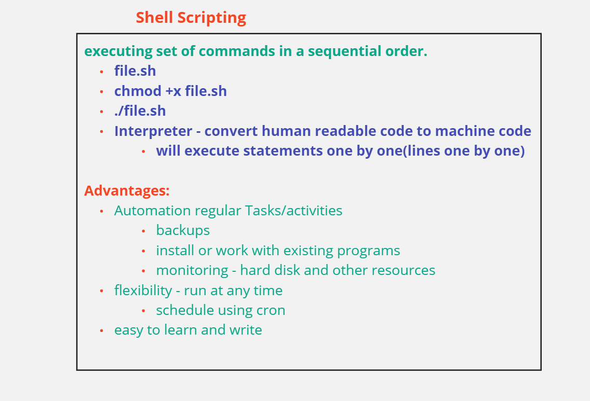
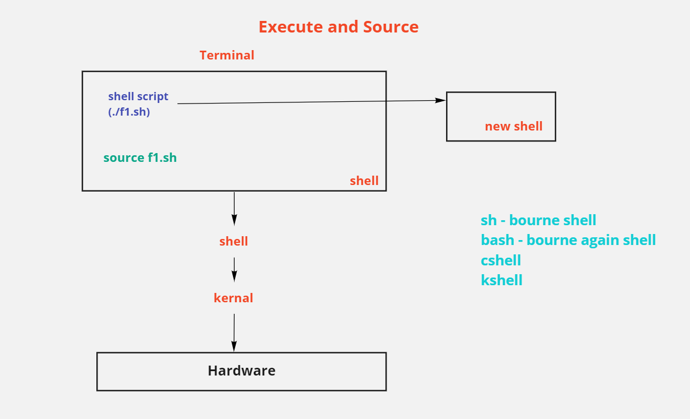
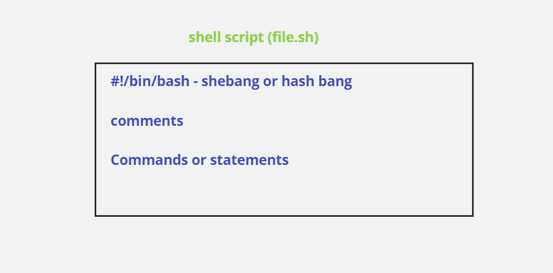
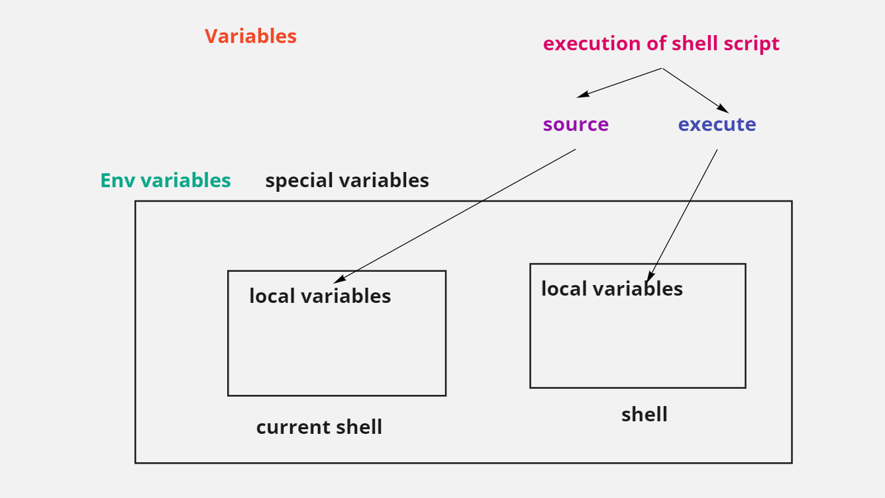
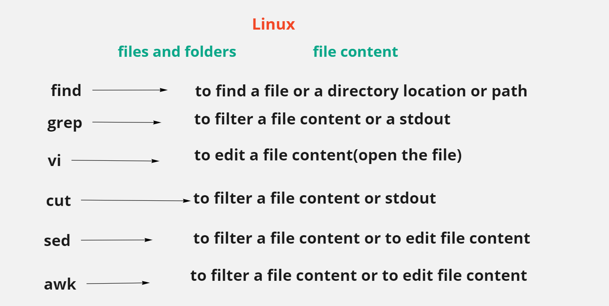
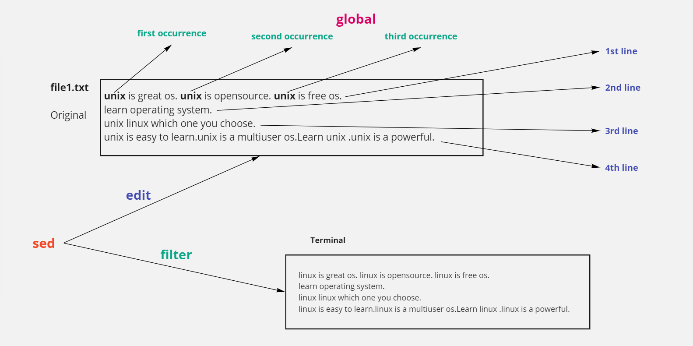
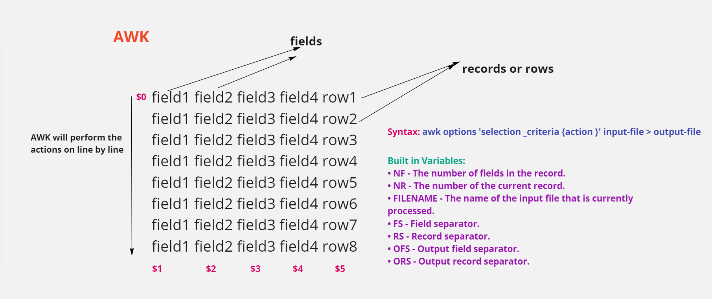
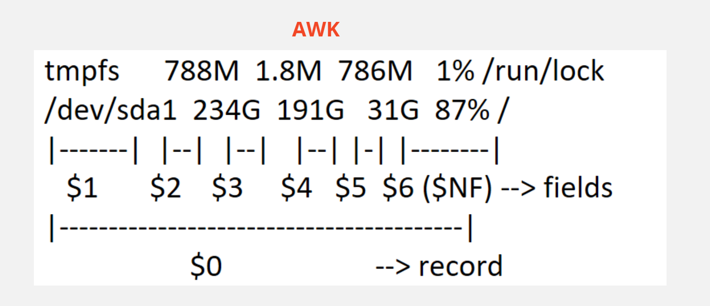
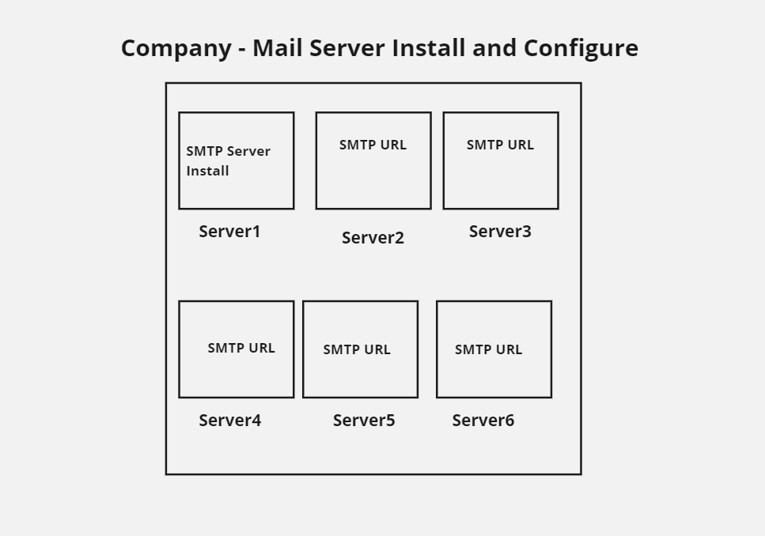

# Shell Scripting

---
## Shell Scripting and It's Advantages

---
## Execute and Source of Shell Script 

---
## Shell Script Basic Syntax

---
## Positional Parameters

---
## Variables with Shell Script

---
## Linux_Advanced_Commands

---
## sed_command

--
**Please use the following url's for practice:**

https://www.geeksforgeeks.org/sed-command-in-linux-unix-with-examples/
https://www.howtogeek.com/666395/how-to-use-the-sed-command-on-linux/

--

---
## AWK Command

---
## AWK_Example

---
## SMTP Server

---
