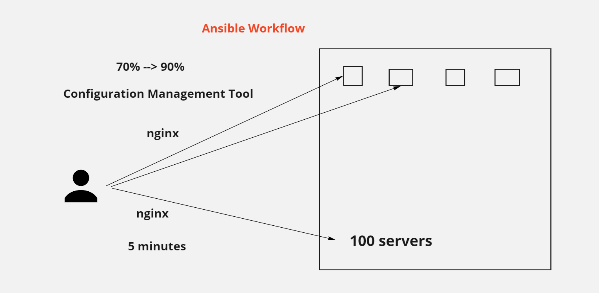
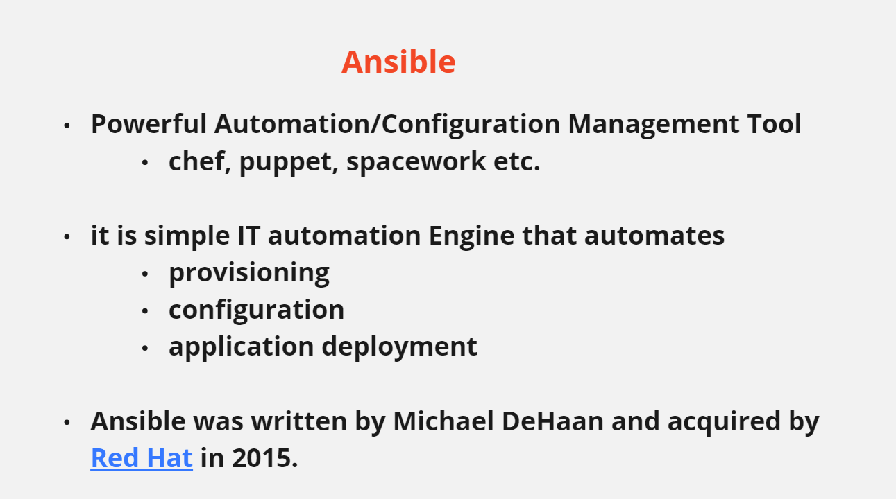

# ANSIBLE
---
## Ansible Workflow



---
## Ansible Introduction



---
## Ansible Features


---
## Ansible Installation and setup
```
	1. Create 3 machines in AWS
		a. One machine as Ansible-Controller ( requirements: 2 CPU's and 2 GB RAM)
		b. Two machines as targets (target1 and target2)
	2. Connect to Ansible Linux EC2 Terminal through mobaxterm or putty.
	3. Switch to root user.
	4. Update Server Packages.
	yum update -y
	5. Change the hostname (computer name) of Ansible-Controller as ansible-controller and target machines as target1 and target2 using the following command
	
	hostnamectl set-hostname 'ansible-controller'
	hostnamectl set-hostname 'target1'
	hostnamectl set-hostname 'target2'
	
	reboot all the 3 servers  - sudo reboot
	
	6. Install the ansible.
		○ install Ansible pre-requisites.
		Download epel repository.
			wget https://dl.fedoraproject.org/pub/epel/epel-release-latest-7.noarch.rpm
		○ Install epel repository.
		yum install epel-release-latest-7.noarch.rpm -y
		○ Update epel repository.
		yum update -y
		○ Install all individual packages inside the repository
		yum install git python python-devel python-pip openssl ansible -y
		○ ansible --version

	7. add the following line under [default] section in /etc/ansible/ansible.cfg
	interpreter_python=auto_silent

	8. SSH connection to targets
		○ SSH connection to targets must be working 
		○ one time setup need to do on target machines and controller
		○ Create ssh key on controller machine and copy that key to target machines authorized_keys file.
			§ Ssh-keygen (ansible-controller)
			§ Copy /home/ec2-user/.ssh/id_rsa.pub file content to 2 target machines inside /home/ec2-user/.ssh/authorized_keys file.
	9. Go to the file /etc/ansible/hosts and add target machines IP Addresses inside the file. Look at the following
		[webservers]
		IP1
		IP2

	10. Do a ping test
	ansible all -m ping
```
---
## Ansible Modules Examples
1. Update the playbook with a play to Execute a script on all web server nodes(web_nodes). The script is located at /tmp/install_script.sh
```
Answer:
- name: 'Execute a script on all web server nodes'
  hosts: web_nodes
  tasks:
  - name: 'Execute a script on all web server nodes'
    script: /tmp/install_script.sh
```
2. Update the playbook to add a new task to start httpd services on all web nodes

Use the Service module
```
Answer:
-
    name: 'Execute a script on all web server nodes'
    hosts: web_nodes
    tasks:
        -
            name: 'Execute a script'
            script: /tmp/install_script.sh
        -
            name: 'Start httpd service'
            service: 'name=httpd state=started'
```
3. Update the playbook to add a new task in the beginning to add an entry into /etc/resolv.conf file for hosts. The line to be added is nameserver 10.1.250.10


Note: The new task must be executed first, so place it accordingly.

Use the Lineinfile module
```
Answer:
-
    name: 'Execute a script on all web server nodes and start httpd service'
    hosts: web_nodes
    tasks:
        -
            name: 'Update entry into /etc/resolv.conf'
            lineinfile:
                path: /etc/resolv.conf
                line: 'nameserver 10.1.250.10'
        -
            name: 'Execute a script'
            script: /tmp/install_script.sh
        -
            name: 'Start httpd service'
            service:
                name: httpd
                state: present

```
4. Update the playbook to add a new task at second position (right after adding entry to resolv.conf) to create a new web user.


Use the user module for this. User details to be used are given below:
Username: web_user
uid: 1040
group: developers
```
Answer:
-
    name: 'Execute a script on all web server nodes and start httpd service'
    hosts: web_nodes
    tasks:
        -
            name: 'Update entry into /etc/resolv.conf'
            lineinfile:
                path: /etc/resolv.conf
                line: 'nameserver 10.1.250.10'
        -
            name: 'Create a new user'
            user:
                name: web_user
                uid: 1040
                group: developers
        -
            name: 'Execute a script'
            script: /tmp/install_script.sh
        -
            name: 'Start httpd service'
            service:
                name: httpd
                state: present
```
---
## Ansible Variables
1. The playbook is used to update name server entry into resolv.conf file on localhost. The name server information is also updated in the inventory file as a variable nameserver_ip. Refer to the inventory file.


Replace the ip of the name server in this playbook to use the value from the inventory file, so that in the future if you had to make any changes you simply have to update the inventory file.
```
-
    name: 'Update nameserver entry into resolv.conf file on localhost'
    hosts: localhost
    tasks:
        -
            name: 'Update nameserver entry into resolv.conf file'
            lineinfile:
                path: /etc/resolv.conf
                line: 'nameserver {{  nameserver_ip  }}'
```
2. We have added a new task to disable SNMP port in the playbook. However the port is hardcoded in the playbook. Update the inventory file to add a new variable snmp_port and assign the value used here. Then update the playbook to use value from the variable.


Remember to use curly braces around the variable name.
```
-
    name: 'Update nameserver entry into resolv.conf file on localhost'
    hosts: localhost
    tasks:
        -
            name: 'Update nameserver entry into resolv.conf file'
            lineinfile:
                path: /etc/resolv.conf
                line: 'nameserver {{ nameserver_ip }}'
        -
            name: 'Disable SNMP Port'
            firewalld:
                port: '{{ snmp_port }}'
                permanent: true
                state: disabled
```
3. We are printing some personal information to the screen. We would like to move the car_model, country_name and title to a variable defined at the play level.


Create three new variables (car_model, country_name and title) under the play and move the values over. Use the variables in the task.
```
-
    hosts: localhost
    vars:
        car_model: 'BMW M3'
        country_name: USA
        title: 'Systems Engineer'
    tasks:
        -
            command: 'echo "My car''s model is {{ car_model }}"'
        -
            command: 'echo "I live in the {{ country_name }}"'
        -
            command: 'echo "I work as a {{ title }}"'
```
Inventory file
```
localhost ansible_connection=localhost nameserver_ip=10.1.250.10 snmp_port=160-161
```
---
