# Docker

---
## BareMetal and VirtualMachine

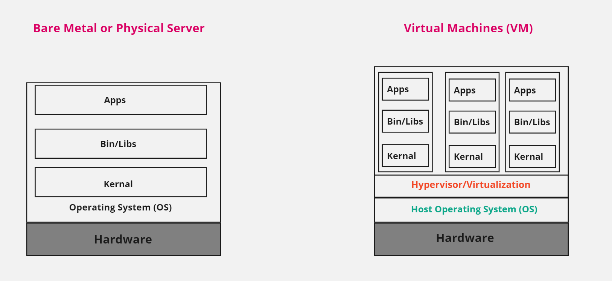

---
## VM Creation On Physical Machine or BareMetal

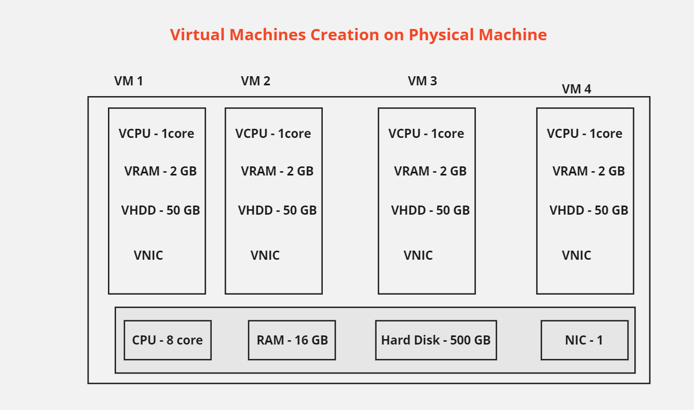

---
## VM Scale Up and Scale Down

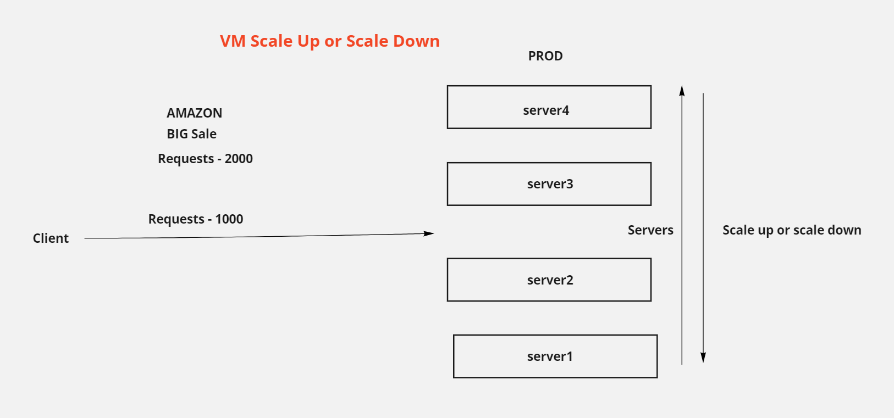

---
## Web Application Deployment

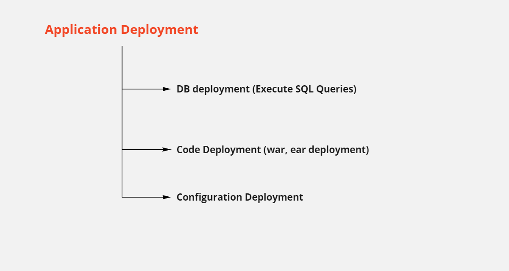

---
## Application Deployment On Different Environments

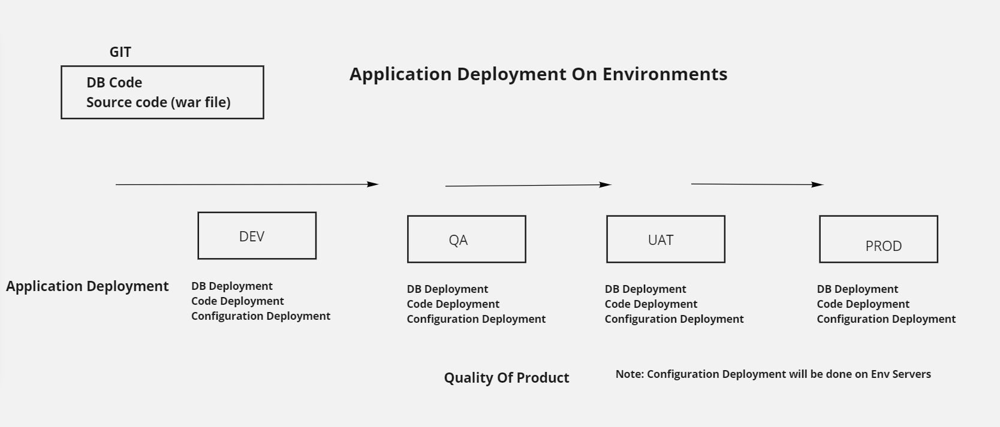

---
## VM and Containers

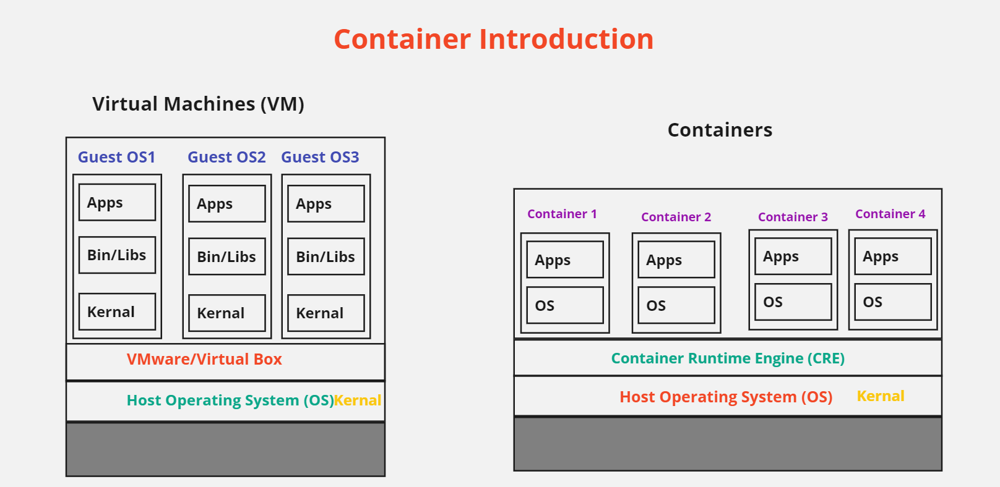

---
## Virtualization and Containerization

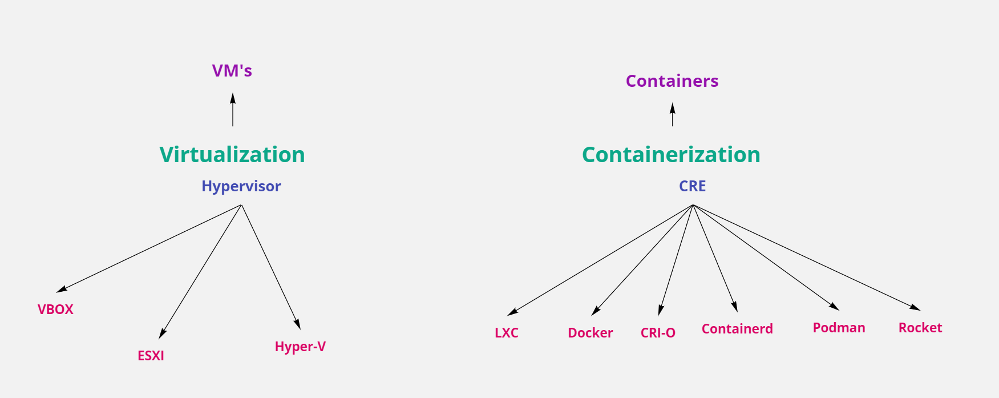

---
## Docker

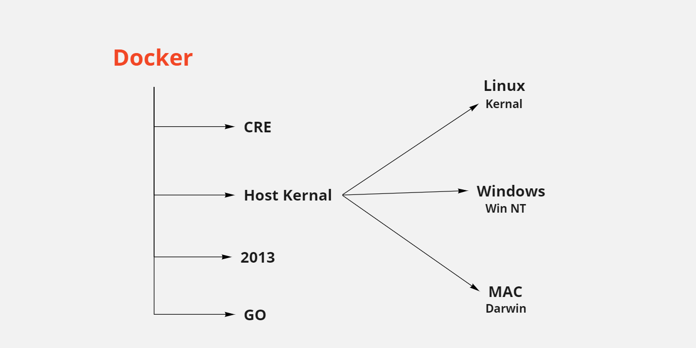

---
## Docker Products

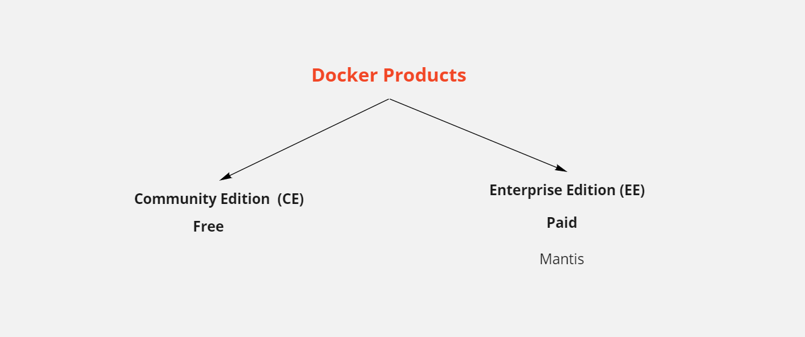

---
## Docker Installation


---
## Docker Client Server Architecture

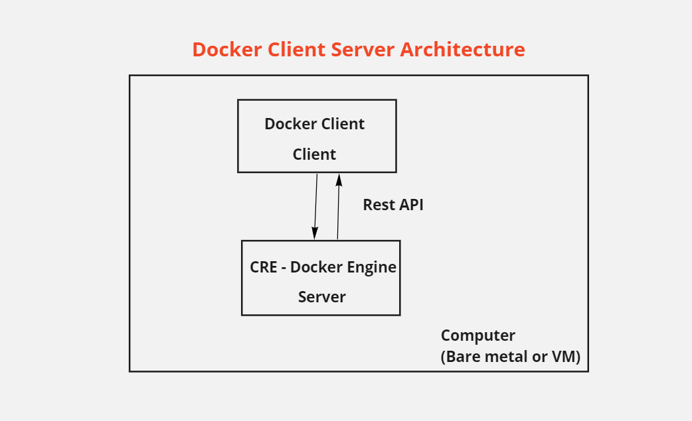

---
## Docker Commands
```
docker images --> to see the local registry images

docker ps --> to see the running containers

docker ps -a --> to see the running and dead(exited) containers

docker pull --> to pull docker image from docker hub or other registry to local registry

docker build --> to build a docker custom image

docker run --> to create a container 

docker search --> to search images from docker cli(Dockerhub)


Docker Root Directory:
/var/lib/docker


docker stop - gracefull
docker kill - forcefull
```
---
## Docker Commands Practice
```
274  docker version
  275  clear
  276  docker --help
  277  clear
  278  docker images
  279  docker run --help
  280  clear
  281  docker run
  282  clear
  283  docker run hello-world
  284  clear
  285  docker images
  286  docker ps
  287  docker ps -a
  288  history
  289  clear
  290  docker run --name helloworld hello-world
  291  docker ps -a
  292  clear
  293  docker ps -a
  294  clear
  295  docker search httpd
  296  clear
  297  docker pull alpine
  298  docker images
  299  clear
  300  docker ps -a
  301  docker run --name satc1 alpine:latest ping google.com
  302  clear
  303  docker run --name satc1 alpine:latest
  304  docker run --name satc2 alpine:latest
  305  docker ps
  306  docker ps -a
  307  clear
  308  cd /var/lib/docker
  309  ls
  310  clear
  311  docker run --name satc3 alpine:latest ping google.com
  312  clear
  313  docker run --name satc3 -d alpine:latest ping google.com
  314  docker run --name satc4 -d alpine:latest ping google.com
  315  clear
  316  docker ps
  317  clear
  318  docker ps
  319  docker exec -it satc4
  320  docker exec -it satc4 /bin/bash
  321  docker exec --help
  322  clear
  323  docker exec -it satc4 /bin/sh
  324  clear
  328  docker ps
  329  docker exec satc5 /bin/sh
  330  clear
  331  docker ps
  332  docker stop satc4
  333  docker ps
  334  docker start satc4
  335  docker ps
  336  clear
  337  docker ps
  338  docker kill satc4
  339  docker ps
  340  docker pause satc5
  341  docker ps
  342  clear
  343  docker unpause satc5
  344  docker ps
  345  docker inspect satc6
  346  clear
  347  docker ps
  348  docker exec -it satc6 /bin/sh
  349  history
  350  docker --help
  351  clear
  352  docker ps
  353  docker ps -a
  354  docker rm satc2
  355  docker ps -a
  356  clear
  357  docker images
  358  docker rmi hello-world
  359  ls
  360  clera
  361  clear
  362  ls
  363  clear
  364  docker images
  365  docker rmi hello-world -f
  366  docker images
  367  clear
  368  history
  210  docker logs satc1
  211  docker logs -f satc1
  212  clear
  213  docker logs -f satc1
  214  clear
  215  docker logs -f satc1

  ```
---
## Create and Connect to Container


---
## Image

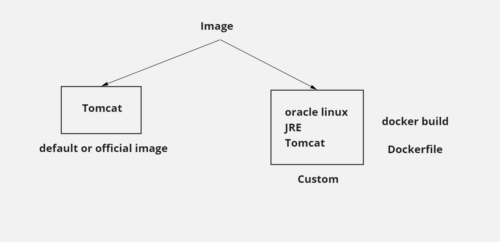

---
## VM Image vs Docker Image

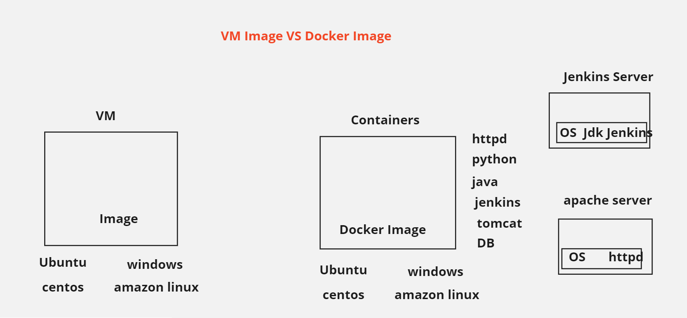

---
## Image for Containers

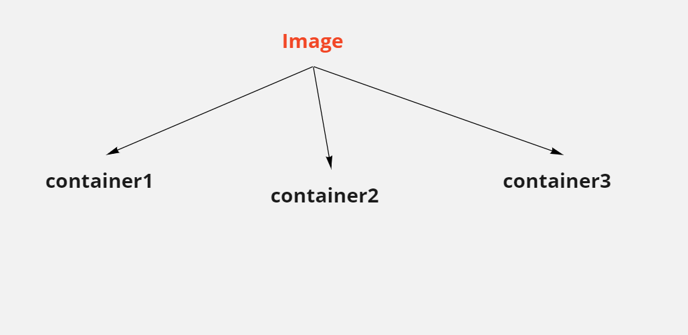

---
## Windows Containers Vs Linux Containers

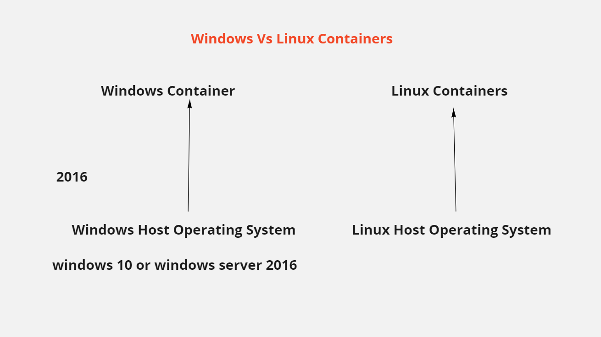

---
## Parent Process for Container Life Time

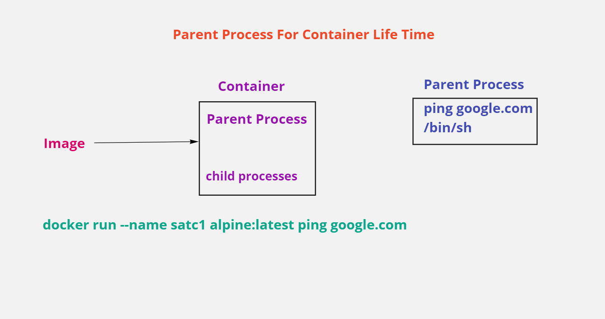

---
## Types of Registry

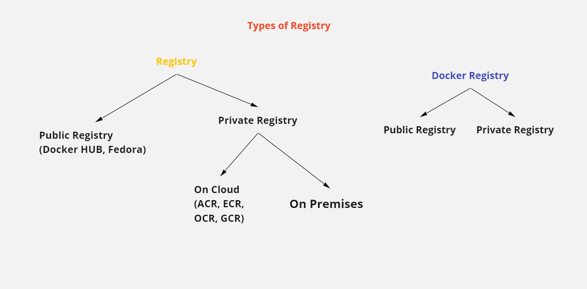

---
## Difference between CMD and ENTRYPOINT

- Both CMD and ENTRYPOINT instructions define what command gets executed when running a container. There are few rules that describe their co-operation.

- Dockerfile should specify at least one of CMD or ENTRYPOINT commands.

- ENTRYPOINT should be defined when using the container as an executable.

- CMD should be used as a way of defining default arguments for an ENTRYPOINT command or for executing an ad-hoc command in a container.

- CMD will be overridden when running the container with alternative arguments.

**URL** 
- https://docs.docker.com/engine/reference/builder/#understand-how-cmd-and-entrypoint-interact
- https://phoenixnap.com/kb/docker-cmd-vs-entrypoint#:~:text=CMD%20is%20an%20instruction%20that,container%20with%20a%20specific%20executable.

---
# Application Containerization

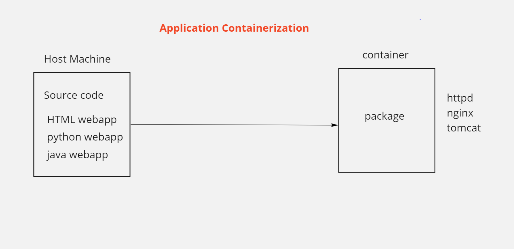

---
# Docker Namespaces

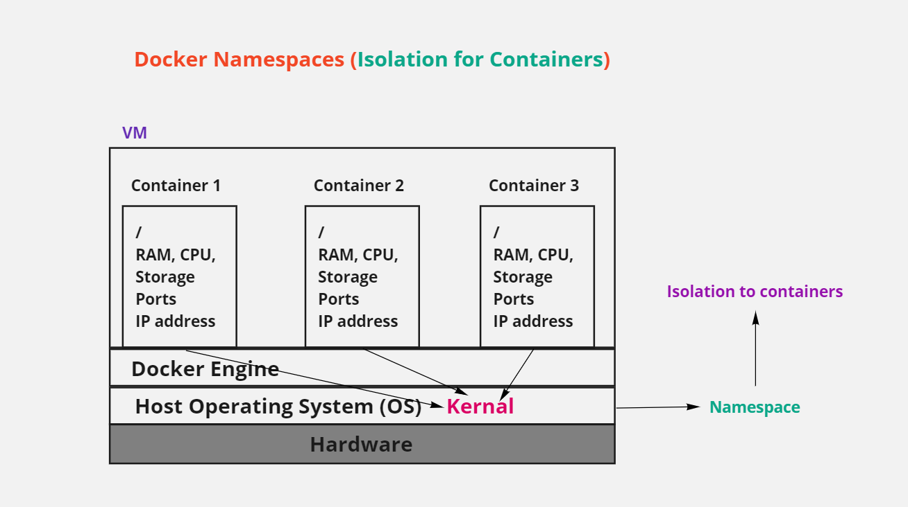

---
# Image Sharing

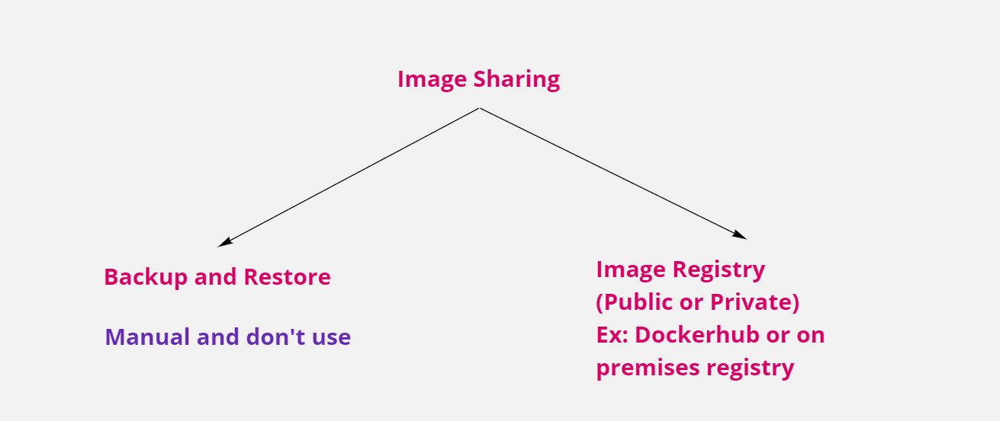

---
# Company Private Registry Setup

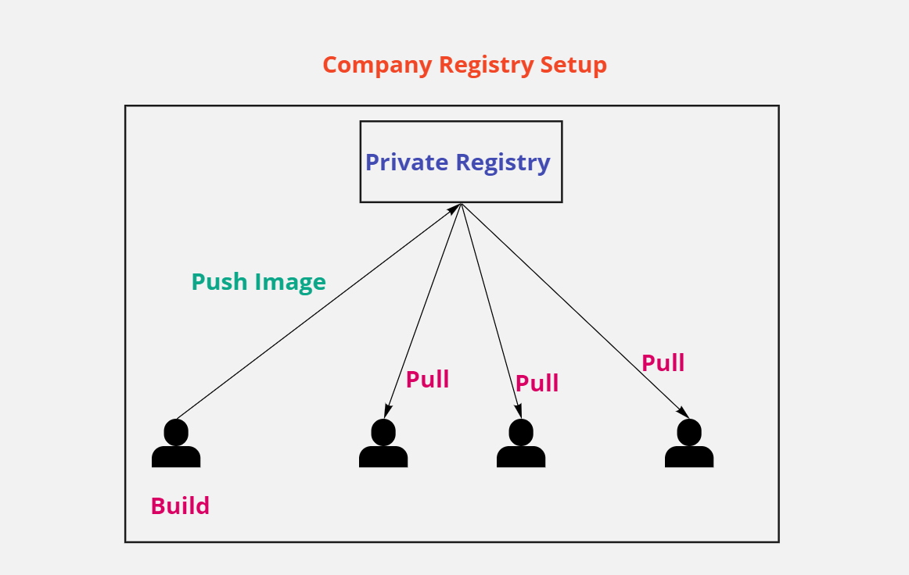

---
# Application Custom Image Deploy to Diff Environments

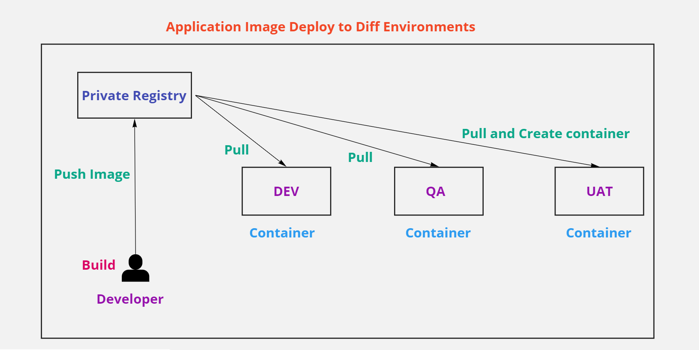

---
# Create Custom Image and Create Container

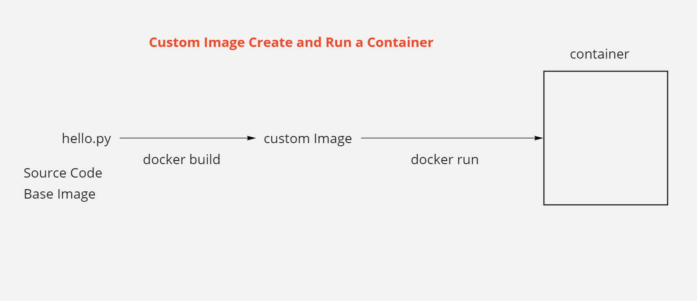

---
# Building Custom Image Using Docker Build Command

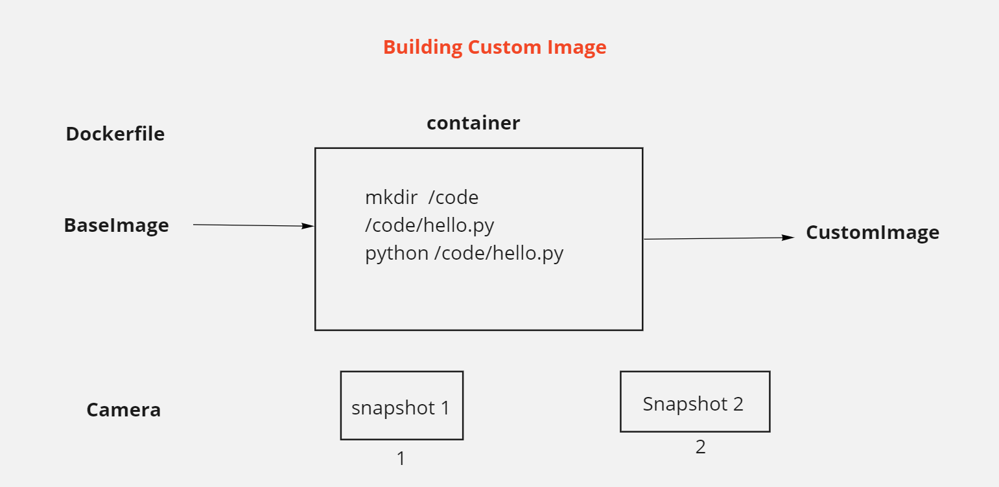

---
# Port Forwarding or Map or Publish or Expose Container Port with Host VM Port

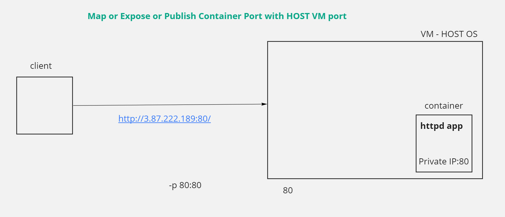

---
# Command History
```
  378  cd /usr/local
  379  ls
  380  cd docker_practice/
  381  ls
  382  history
  383  cd /usr/local
  384  ls
  385  cd docker_practice/
  386  ls
  387  cleaer
  388  clear
  389  mkdir httpdapp
  390  cd httpdapp/
  391  cat > httpd.dockerfile
  392  cat httpd.dockerfile
  393  clear
  394  docker build -t sathttpd_img:v1 .
  395  docker build -t sathttpd_img:v1 -f httpd.dockerfile .
  396  clear
  397  vi httpd.dockerfile
  398  docker build -t sathttpd_img:v1 -f httpd.dockerfile .
  399  ls
  400  cat httpd.dockerfile
  401  yum install git -y
  402  clear
  403  ls
  404  cat httpd.dockerfile
  405  mkdir webapp
  406  git clone https://gitlab.com/chinnu1028/beginner-html-site-styled.git
  407  ls
  408  rm -rf webapp/
  409  mv beginner-html-site-styled/ webapp
  410  ls
  411  clear
  412  docker build -t sathttpd_img:v1 -f httpd.dockerfile .
  413  cat httpd.dockerfile
  414  curl ifconfig.io
  415  clar
  416  clear
  417  docker ps
  418  docker ps -a
  419  clear
  420  docker images
  421  docker run --name sathttpdc1 -d sathttpd_img:v1
  422  curl ifconfig.io
  423  cat httpd.dockerfile
  424  docker run --name sathttpdc1 -d -p 80:80 sathttpd_img:v1
  425  docker run --name sathttpdc2 -d -p 80:80 sathttpd_img:v1
  426  docker ps
  427  docker rm sathttpdc1 -f
  428  clear
  429  docker ps
  430  cd ..
  431  ls
  432  mkdir tomcatapp
  433  cd tomcatapp/
  434  cat > Dockerfile
  435  cat Dockerfile
  436  clear
  437  cat Dockerfile
  438  docker ps
  439  cd ..
  440  ls
  441  cd httpdapp/
  442  clear
  443  docke rps
  444  docker ps
  445  docker rm sathhtpdc2
  446  docker rm sathtpdc2
  447  docker rm sathttpdc2
  448  docker rm sathttpdc2 -f
  449  clear
  450  docke rps
  451  docker ps
  452  clear
  453  history
  454  vi httpd.dockerfile
  455  clear
  456  docker build -t sathttpd_test:v1 -f httpd.dockerfile .
  457  docker run --name sathttpdc3 -d sathttpd_test:v1 -p 80:80
  458  docker ps
  459  clear
  460  history
  461  docker run --name sathttpdc3 -d -p 80:80 sathttpd_test:v1
  462  docker run --name sathttpdc4 -d -p 80:80 sathttpd_test:v1
  463  docker ps
  464  clear
  465  cd ..
  466  ls
  467  cd tomcatapp/
  468  ls
  469  git clone https://gitlab.com/chinnu1028/springboot.git
  470  ls
  471  cat Dockerfile
  472  clear
  473  ls
  474  cd springboot/
  475  ls
  476  cd project-java-spring-webapp/
  477  ls
  478  pqd
  479  pwd
  480  cd ..
  481  ls
  482  cd ..
  483  ls
  484  pwd
  485  vi Dockerfile
  486  clear
  487  docker build -t tomcatapp:v1 .
  488  docker run --name sattomc1 -d -p 8080:8080 tomcatapp:v1
  489  curl ifconfig.io
  490  cat Dockerfile
  491  clear
  492  ls
  493  cat Dockerfile
  494  docker ps
  495  docker exec -it sattomc1 /bin/sh
  496  clear
  497  docker ps
  498  docker rm sattomc1
  499  ls
  500  docker rm sattomc1 -f
  501  clear
  502  ls
  503  cd springboot/
  504  ls
  505  cd project-java-spring-webapp/
  506  ls
  507  mv ../../Dockerfile .
  508  ls
  509  clear
  510  pwd
  511  ls
  512  docker images
  513  docker rm sathttpd tomcatapp:v1
  514  docker rm sathttpd tomcatapp:v1 -f
  515  docker rmi sathttpd tomcatapp:v1
  516  ls
  517  docker images
  518  clear
  519  ls
  520  vi Dockerfile
  521  docker build -t tom:v1 .
  522  docker run --name sattomc1 -d -p 8080:8080 tom:v1
  523  docker ps
  524  docker exec -it sattomc1 /bin/sh
  525  clear
  526  ls
  527  pwd
  528  clear
  529  ls
  530  vi Dockerfile
  531  docker images
  532  docker rmi tom:v1
  533  docker rmi tom:v1 -f
  534  ls
  535  docker images
  536  df -h
  537  clear
  538  df -sh
  539  df -h
  540  clear
  541  ls
  542  docker images
  543  docker ps
  544  docker rm sattomc1 -f
  545  clear
  546  ls
  547  docker build -t tom:v1 .
  548  docker run --name sattommc1 -d -p 8080:8080 tom:v1
  549  docke rps
  550  docker ps
  551  docker exec -it sattommc1
  552  docker exec -it sattommc1 /bin/sh
  553  clear
  554  docker ps
  555  docker exec -it sattommc1 sh
  556  clear
  557  docker network
  558  docker network ls
  559  docker network create --help
  560  clear
  561  docker login
  562  docker ls
  563  docker images
  564  ls
  565  clear
  566  docker search alpine
  567  clear
  568  logout
  569  docker logout
  570  clear
```
---
## creating and exploring bridge
```
[ec2-user@ip-172-31-81-232 ~]$ docker  network  create  satbr1 
2f2458bbe0529171c06f33551240470a245df9f79393c0cca854dcf9a67c281f
[ec2-user@ip-172-31-81-232 ~]$ docker  network  ls


docker  network inspect  satbr1


docker run -d --name satx1 --network satbr1  alpine ping fb.com 

docker run -d --name satx2 --network satbr1  alpine ping fb.com

docker  network inspect  satbr1


docker  exec -it  satx1  sh


/ # ping satx2
```
---
## Cgroups in containers
```
267  docker run -d --name x1  alpine ping fb.com 
  268  docker  ps 
  269  docker  stats x1 
  270  history 
  271  docker  stats 
  272  history 
  273  docker ps
  274  docker run -d --name x3  --memory 100m   alpine ping fb.com 
 ```
 ---
## CPU and ram limiting
```
282  docker run -d --name x4  --cpuset-cpus=0 --cpu-shares=20   alpine ping fb.com 
 283  docker run -d --name x5  --cpuset-cpus=0 --cpu-shares=20  -m 200m  alpine ping fb.com
```
---
## pushing image on docker hub
```
352  docker  login  
  353  docker  images  |   grep -i sat
  354  docker  tag  satjsp:v1    dockersat/satjsp:v1  
  355  docker  images  |   grep -i sat
  356  docker  push  dockersat/satjsp:v1  
  357  docker  logout 
```
---
## Docker Volumes
```
Volumes are the preferred mechanism for persisting data generated by and used by Docker containers. While bind mounts are dependent on the directory structure and OS of the host machine, volumes are completely managed by Docker. Volumes have several advantages over bind mounts:
	• Volumes are easier to back up or migrate than bind mounts.
	• You can manage volumes using Docker CLI commands or the Docker API.
	• Volumes work on both Linux and Windows containers.
	• Volumes can be more safely shared among multiple containers.
	• Volume drivers let you store volumes on remote hosts or cloud providers, to encrypt the contents of volumes, or to add other functionality.
	• New volumes can have their content pre-populated by a container.
	• Volumes on Docker Desktop have much higher performance than bind mounts from Mac and Windows hosts.
In addition, volumes are often a better choice than persisting data in a container’s writable layer, because a volume does not increase the size of the containers using it, and the volume’s contents exist outside the lifecycle of a given container.

From <https://docs.docker.com/storage/volumes/> 
```
---
## File Based:
```
docker  run  -it --name x1  -v  /root/hello.txt:/root/a.txt   alpine  sh
```

---
## Folder Based:
```
docker  volume  create  satvol 

docker run -it --name satc1  -v  satvol:/data:rw   alpine  sh 

docker  volume  inspect  satvol
```

---
## External directory using volume
```
 431  git clone https://github.com/mdn/beginner-html-site-styled 
  432  ls
  433  docker run -d --name xui1 -p 2002:80  -v /root/beginner-html-site-styled/:/var/www/html:ro httpd 
  434  docker run -d --name xui11 -p 2012:80  -v /root/beginner-html-site-styled/:/usr/share/nginx/html:ro nginx 
```
---
## Starting docker daemon in TCP socket
```
[ec2-user@ip-172-31-81-232 ~]$ cd /etc/sysconfig/
[ec2-user@ip-172-31-81-232 sysconfig]$ ls
acpid       clock     docker          i18n        man-db      network-scripts  readonly-root  rsyslog    sysstat
atd         console   docker-storage  init        modules     nfs              rpc-rquotad    run-parts  sysstat.ioconf
authconfig  cpupower  grub            irqbalance  netconsole  raid-check       rpcbind        selinux
chronyd     crond     htcacheclean    keyboard    network     rdisc            rsyncd         sshd
[ec2-user@ip-172-31-81-232 sysconfig]$ sudo vim docker
[ec2-user@ip-172-31-81-232 sysconfig]$ sudo systemctl daemon-reload 
[ec2-user@ip-172-31-81-232 sysconfig]$ sudo systemctl restart  docker
[ec2-user@ip-172-31-81-232 sysconfig]$ cat docker
# The max number of open files for the daemon itself, and all
# running containers.  The default value of 1048576 mirrors the value
# used by the systemd service unit.
DAEMON_MAXFILES=1048576
# Additional startup options for the Docker daemon, for example:
# OPTIONS="--ip-forward=true --iptables=true"
# By default we limit the number of open files per container
OPTIONS="--default-ulimit nofile=1024:4096 -H tcp://0.0.0.0:2375  -H unix:///var/run/docker.sock"
# How many seconds the sysvinit script waits for the pidfile to appear
# when starting the daemon.
DAEMON_PIDFILE_TIMEOUT=10
```
---
## TO connect multi docker engine we use context
```
❯ docker  context  ls
NAME                TYPE                DESCRIPTION                               DOCKER ENDPOINT               KUBERNETES ENDPOINT                 ORCHESTRATOR
default *           moby                Current DOCKER_HOST based configuration   unix:///var/run/docker.sock   https://127.0.0.1:55000 (default)   swarm

creating context
❯ docker  context  create  staging  --docker  "host=tcp://54.161.225.68:2375"
staging
Successfully created context "staging"
❯ 
❯ docker  context  ls
NAME                TYPE                DESCRIPTION                               DOCKER ENDPOINT               KUBERNETES ENDPOINT                 ORCHESTRATOR
default *           moby                Current DOCKER_HOST based configuration   unix:///var/run/docker.sock   https://127.0.0.1:55000 (default)   swarm
staging             moby                                                          tcp://54.161.225.68:2375                          
❯ docker  context use staging
staging
❯ docker  context  ls
NAME                TYPE                DESCRIPTION                               DOCKER ENDPOINT               KUBERNETES ENDPOINT                 ORCHESTRATOR
default             moby                Current DOCKER_HOST based configuration   unix:///var/run/docker.sock   https://127.0.0.1:55000 (default)   swarm
staging *           moby 
```
---
## Update docker file with socket information first before portainer web ui deployment

## Vi /etc/sysconfig/docker
```
# The max number of open files for the daemon itself, and all
# running containers.  The default value of 1048576 mirrors the value
# used by the systemd service unit.
DAEMON_MAXFILES=1048576
# Additional startup options for the Docker daemon, for example:
# OPTIONS="--ip-forward=true --iptables=true"
# By default we limit the number of open files per container
OPTIONS="--default-ulimit nofile=1024:4096 -H tcp://0.0.0.0:2375  -H unix:///var/run/docker.sock"
# How many seconds the sysvinit script waits for the pidfile to appear
# when starting the daemon.
DAEMON_PIDFILE_TIMEOUT=10
```
---
## portainer web UI deployment on Docker engine
```
[ec2-user@ip-172-31-81-232 ~]$ docker run -d --name webui -p 1199:9000 -v  /var/run/docker.socker:/var/run/docker.sock portainer/portainer  
34879fd176bcb93e525bd80125db4cf44f0b6f1f270e486be2efdf6e33036b54
[ec2-user@ip-172-31-81-232 ~]$ docker  ps
CONTAINER ID        IMAGE                 COMMAND             CREATED             STATUS              PORTS                    NAMES
34879fd176bc        portainer/portainer   "/portainer"        3 seconds ago       Up 2 seconds        0.0.0.0:1


docker run -d --name webui -p 9000:9000  -v  /var/run/docker.sock:/var/run/docke.sock portainer/portainer
```

---
---
## ATOM IDE TOOL FOR YAML:
	• ATOM Install
	• Haml-lint package install

## Docker compose Installation:
https://docs.docker.com/compose/install/


## Docker compose file version history:
https://docs.docker.com/compose/compose-file/

## Example 1
```
[ec2-user@ip-172-31-81-232 satexample1]$ cat  docker-compose.yaml 
version: "3.8"
services:
 satapp1:
  image: alpine
  container_name: satc1
  command: ping fb.com
  
[ec2-user@ip-172-31-81-232 satexample1]$ docker-compose ps
 Name      Command     State   Ports
------------------------------------
satc1   ping fb.com   Up           
[ec2-user@ip-172-31-81-232 satexample1]$ docker-compose stop
Stopping satc1 ... done
[ec2-user@ip-172-31-81-232 satexample1]$ docker-compose start
Starting satapp1 ... done
[ec2-user@ip-172-31-81-232 satexample1]$ docker-compose ps
 Name      Command     State   Ports
------------------------------------
satc1   ping fb.com   Up           
[ec2-user@ip-172-31-81-232 satexample1]$ docker-compose kill
Killing satc1 ... done
[ec2-user@ip-172-31-81-232 satexample1]$ docker-compose ps
 Name      Command      State     Ports
---------------------------------------
satc1   ping fb.com   Exit 137        
[ec2-user@ip-172-31-81-232 satexample1]$ docker-compose start
Starting satapp1 ... done


[ec2-user@ip-172-31-81-232 satexample1]$ docker-compose  down
Stopping satc1 ... done
Removing satc1 ... done
Removing network satexample1_default
```
---
## Example 2
```
[ec2-user@ip-172-31-81-232 satcompose1]$ cat  jsp-compose.yaml 
version: "3.8"
services:
 satjavaapp1:
  image: satjsp:v1
  container_name: satwb1
  ports:  # is an array object 
   - "2233:8080"
   
Deployment
[ec2-user@ip-172-31-81-232 satcompose1]$ docker-compose  -f  jsp-compose.yaml    up  -d
```

---
## Example 3
```
[ec2-user@ip-172-31-81-232 satcompose1]$ cat portainer.yml 
version: "3.8"
services:
 satwebuiapp1:
  image: portainer/portainer
  container_name: satwebui
  ports:  # is an array object 
   - "2233:9000"
  volumes:
   - "/var/run/docker.sock:/var/run/docker.sock"
   
[ec2-user@ip-172-31-81-232 satcompose1]$ docker-compose -f portainer.yml up  -d
Creating network "satcompose1_default" with the default driver
Pulling satwebuiapp1 (portainer/portainer:)...
latest: Pulling from portainer/portainer
d1e017099d17: Pull complete
717377b83d5c: Pull complete
Digest: sha256:f8c2b0a9ca640edf508a8a0830cf1963a1e0d2fd9936a64104b3f658e120b868
Status: Downloaded newer image for portainer/portainer:latest
Creating satwebui ... done
[ec2-user@ip-172-31-81-232 satcompose1]$ docker-compose -f portainer.yml ps
 Name       Command     State           Ports         
-------------------------------------------------------
satwebui   /portainer   Up      0.0.0.0:2233->9000/tcp
[ec2-user@ip-172-31-81-232 satcompose1]$ docker-compose -f portainer.yml  logs
```
---
## Example 4
```
  550  docker-compose -f multi-container.yml  up -d
  551  docker-compose -f multi-container.yml  ps
  552  docker-compose -f multi-container.yml  satjavaapp1  logs
  553  docker-compose -f multi-container.yml   logs satjavaapp1
  554  history 
[ec2-user@ip-172-31-81-232 satcompose1]$ cat multi-container.yml 
version: "3.8"
services:
 satjavaapp1:  # app 1
  image: dockersat/satjsp:v1
  container_name: satwb1
  ports:  # is an array object 
   - "2233:8080"
satalpineapp2:  #  app2
  image: alpine
  container_name: satc22
  command: ping 8.8.8.8
[ec2-user@ip-172-31-81-232 satcompose1]$ docker-compose -f multi-container.yml   stop  satjavaapp1
Stopping satwb1 ... done
[ec2-user@ip-172-31-81-232 satcompose1]$ docker-compose -f multi-container.yml   ps
 Name         Command        State     Ports
--------------------------------------------
satc22   ping 8.8.8.8      Up              
satwb1   catalina.sh run   Exit 143        
[ec2-user@ip-172-31-81-232 satcompose1]$ docker-compose -f multi-container.yml   start  satjavaapp1
Starting satjavaapp1 ... done
[ec2-user@ip-172-31-81-232 satcompose1]$ docker-compose -f multi-container.yml   start  satjavaapp1
```
---
## Example 5 build and create
```
[ec2-user@ip-172-31-81-232 pyapp]$ ls
Dockerfile  docker-compose.yml  hello.py
[ec2-user@ip-172-31-81-232 pyapp]$ cat  docker-compose.yml 
version: "3.8"
services:
 satpyapp1:
  image: satpython:v1  # this time want to build this image 
  build: .  # location of dockerfile 
  container_name: satpc1  #  if image got build successfully then container will be created
```
---
## Example 6 :
```
[ec2-user@ip-172-31-81-232 htmlapp]$ cat  docker-compose.yml 
version: "3.8"
services:
 satsvc11:
  image: newimgsat:v2
  build: 
   context: .  # location of dockerfile 
   dockerfile: myhttpd.dockerfile  # name of dockerfile 
  container_name: satxc1
  ports:
   - "5522:80"
```

---

##Final example
```
[ec2-user@ip-172-31-81-232 htmlapp]$ cat  mysql.yml 
# Use root/example as user/password credentials
version: '3.1'
services:
db:
    image: mysql
    command: --default-authentication-plugin=mysql_native_password
    restart: always
    environment:
      MYSQL_ROOT_PASSWORD: example
adminer:
    image: adminer
    restart: always
    ports:
      - 8080:8080
    depends_on:
     - db  # name of app service 

```
---


