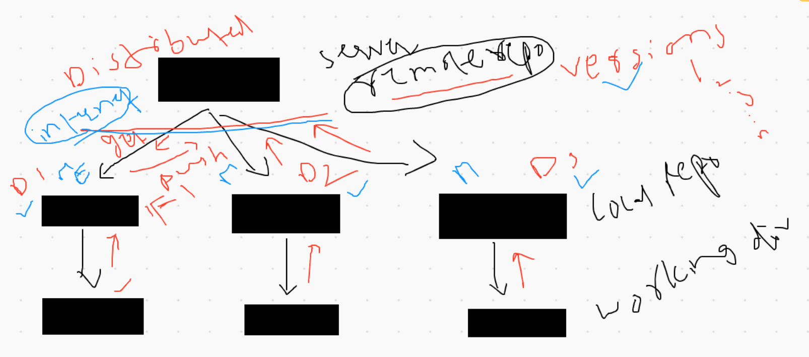
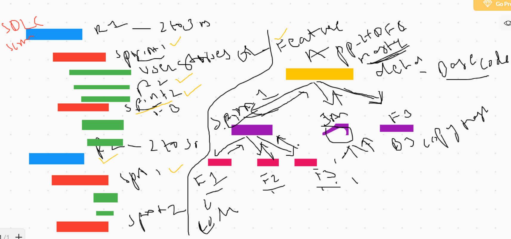
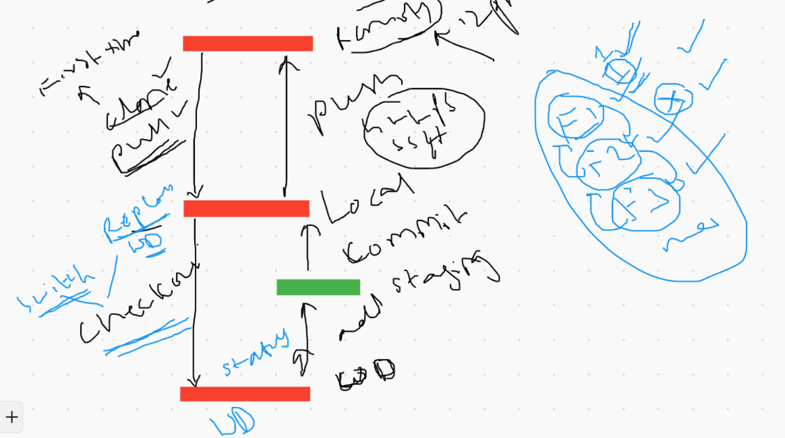
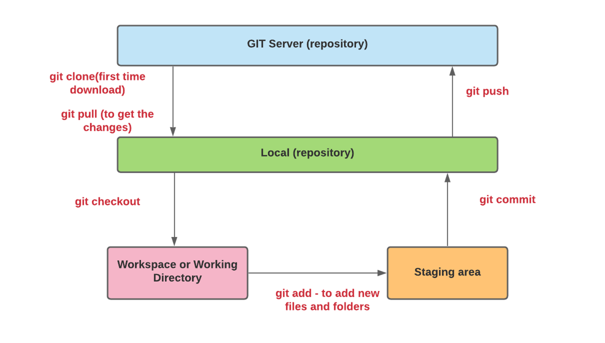
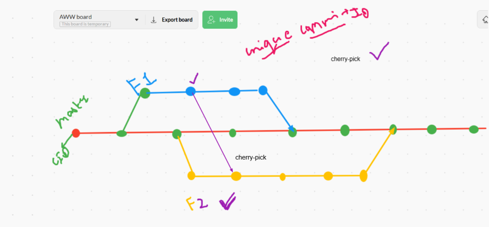
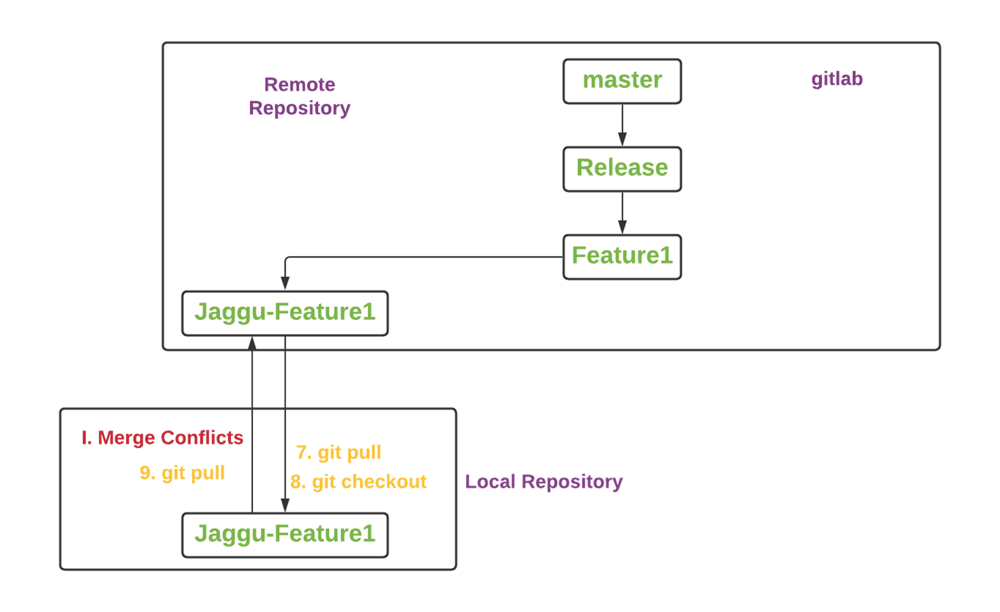
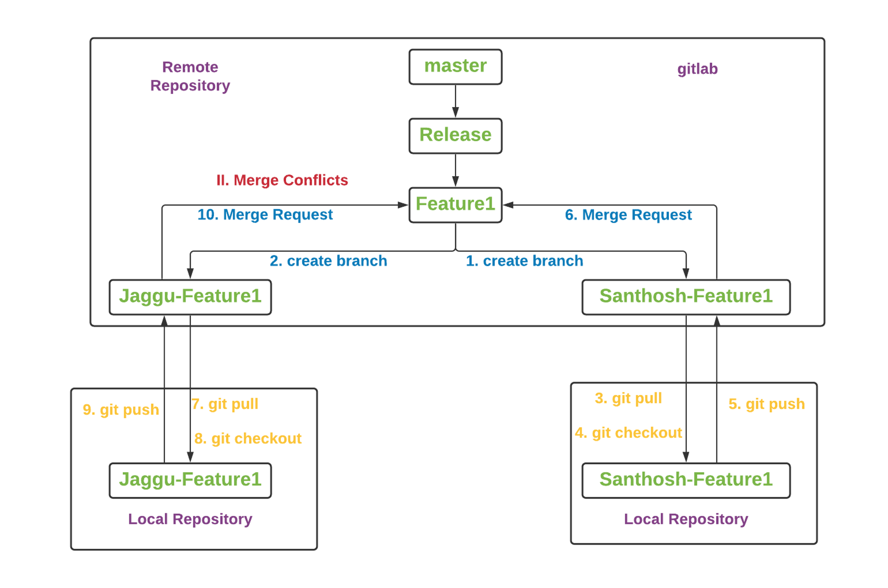

# GIT

---
## DistributedGIT




---
## BranchingStrategy




---
## GITWorkFlow




---
## GIT Architecture



----
## Working on GITHUB repository

**SSH key create and upload**
1. create ssh key using gitbash client
2. upload ssh key to github server

**Create a Test Repository, Download to local Repository and Upload to Remote Repository**
1. create repository "TEST" in github server
2. copy ssh url of TEST repository from github server
3. create a folder (portal) in your laptop home directory(c:/users/username) 
4. open git bash client
5. go to portal path (newly created folder - look at 3rd step)
6. use git clone command to get remote repository into local repository 
      ex: git clone git@github.com:chinnu1028/TEST.git
7. using following url go to github page and download zip file(please see the snapshot below)
8. extract or unzip the downloaded folder
9. copy and paste all the files and folders from extracted Folder(maven-project2-master) to portal directory(which is created in 3rd step)
10. git status (it shows unstaged changes) 
11. git add . (this command will add all the files and folders from working directory to staging area)
12. git status (it shows staged changes)
13. git commit -m "added files and folders" (it saves all the changes from staging to local repository)
14. git push ( it upload all added files from local repository to remote repository)
15. go to github check the TEST repository, now you see the uploaded files and directories.

---
**GIT Administrator Tasks/Activities**
1. setting up Git server (creating Linux Machine and install GIT software on it)
2. creating Repositories(Remote Repository & Local Repository)
3. Access permissions to all Developers and Testers
4. Maintaining Repositories (Remote Repositories)
5. Creating Branches (Master, Release, Sprint and Feature Branches)
6. Resolving Merge Conflicts(if any)
7. Accepting Merge Requests or Pull Requests(which are created or raised by Developers)
8. Creating Tags

---
## GIT cherry-pick



**cherry-pick**
pick one or more commits from one branch to another branch
Ex: git cherry-pick commitID

**Note:** git commit is not required for cherry-pick i.e automatically commited to required branch.

---
## Merge
merge one branch into another branch

## Merge conflicts - 3 cases
1. merging remote branch into local branch - git pull ( remote branch to local branch)
2. merging one branch into another branch ( remote repository branches)
3. merging one branch into another branch (git rebase - remote repository branches)

## Resolving merge conflicts
2 ways 
- using webclient 
- locally using tortoise git client

Locally:
1. git checkout Jaggu-Feature1
2. git pull
3. git checkout Feature1
4. git pull
5. git merge --no-ff "Jaggu-Feature1"
6. git push

```
## Case1



```
## Case2


