# TOMCAT
---
## JDK and JRE

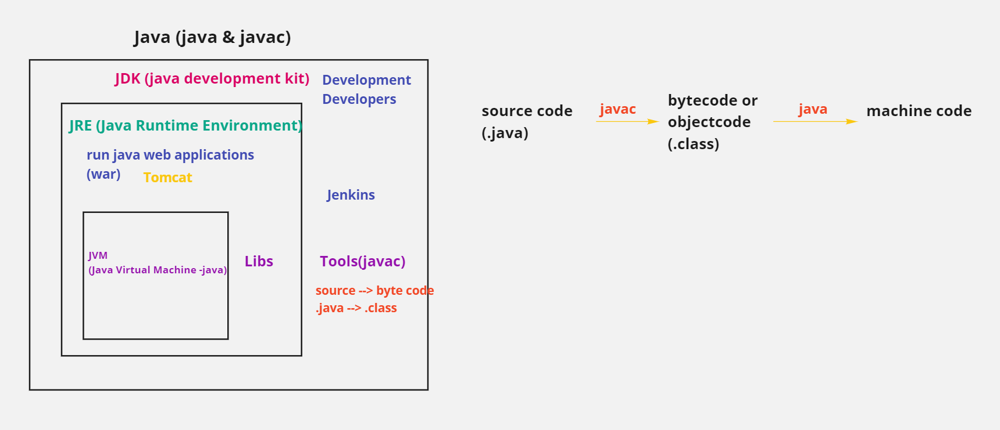

---
## 2 Tier Architecture

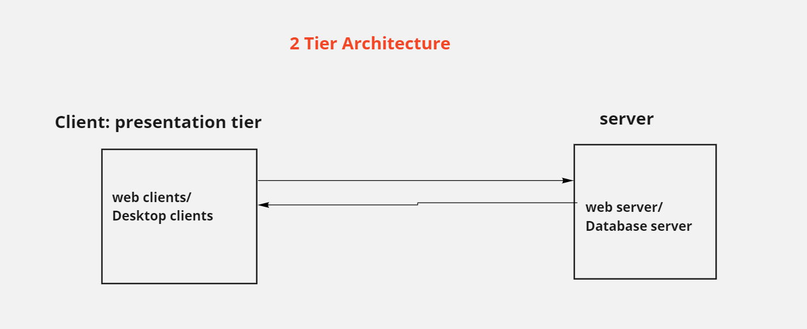

---
## 3 Tier Architecture

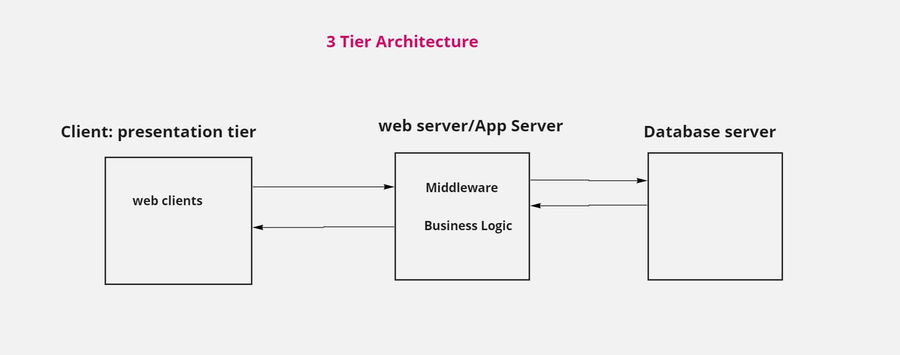

---
## Application Server

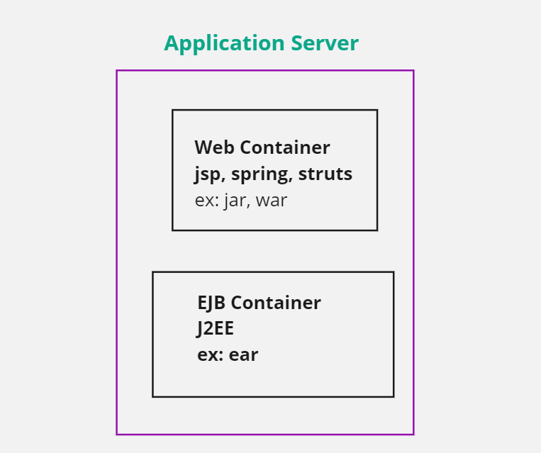

---
## Tomcat Application Server

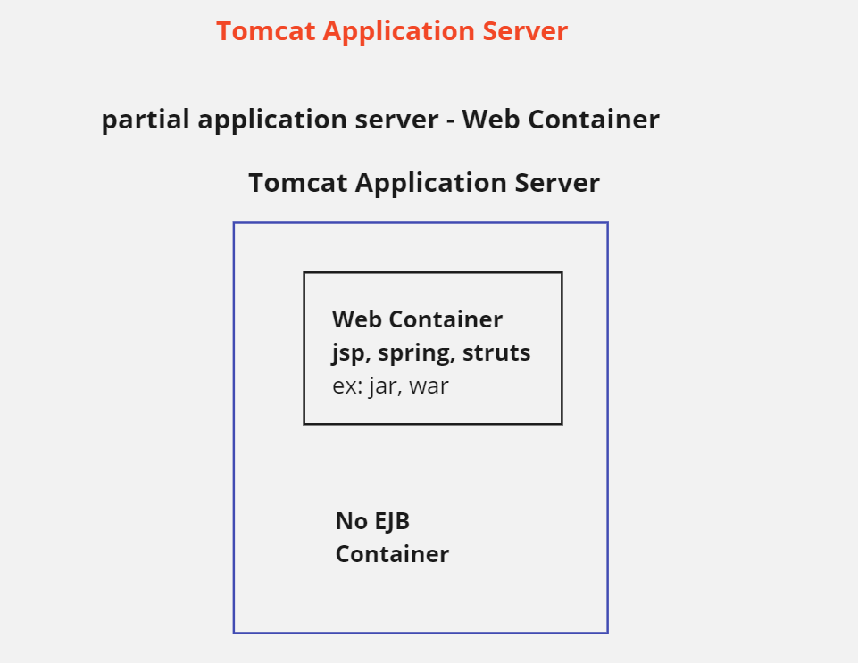

---
## Webserver and Appserver

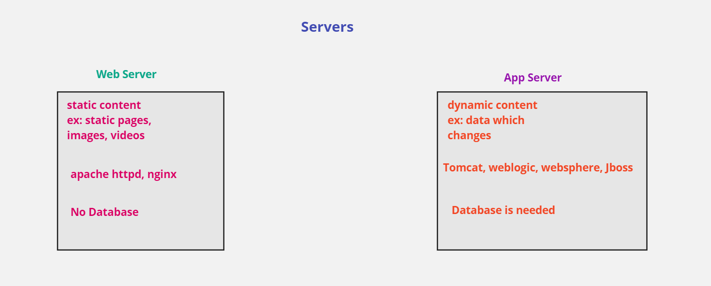

---
## 3 Tier Architecture - Web Server, Application Server and Database Server

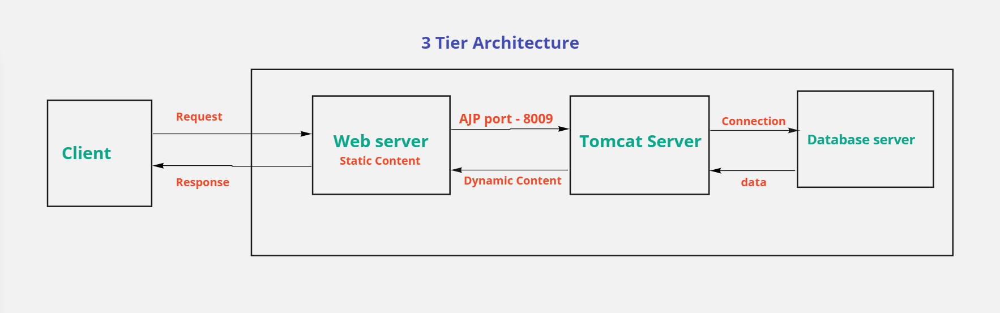

---
## Tomcat Home Directory Structure

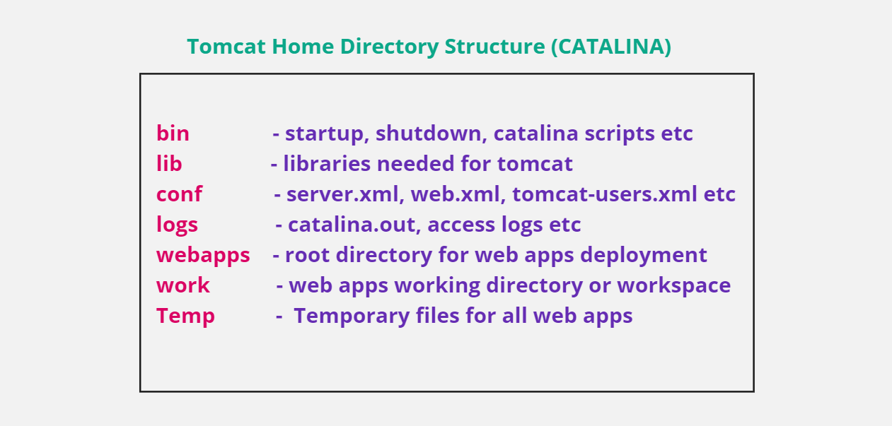

---
## Tomcat Architecture

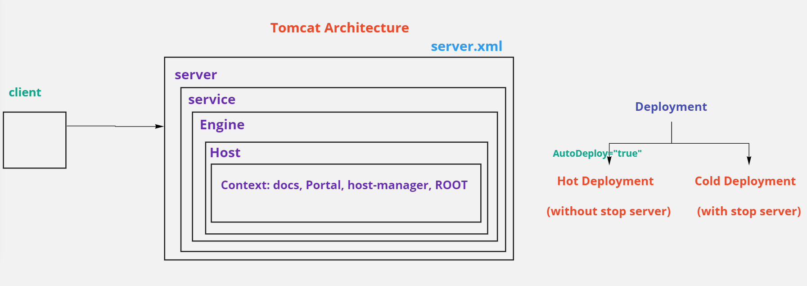

---
## web.xml

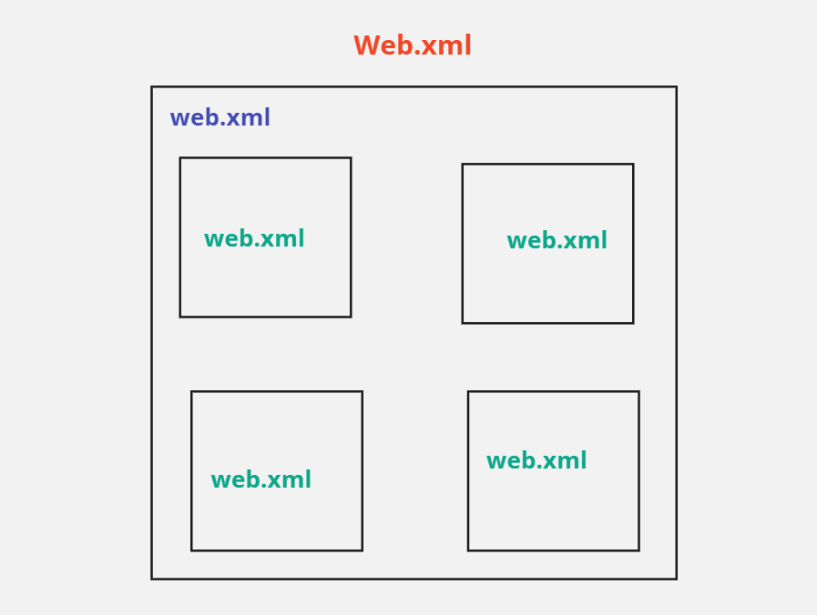

---
## Web Application Structure

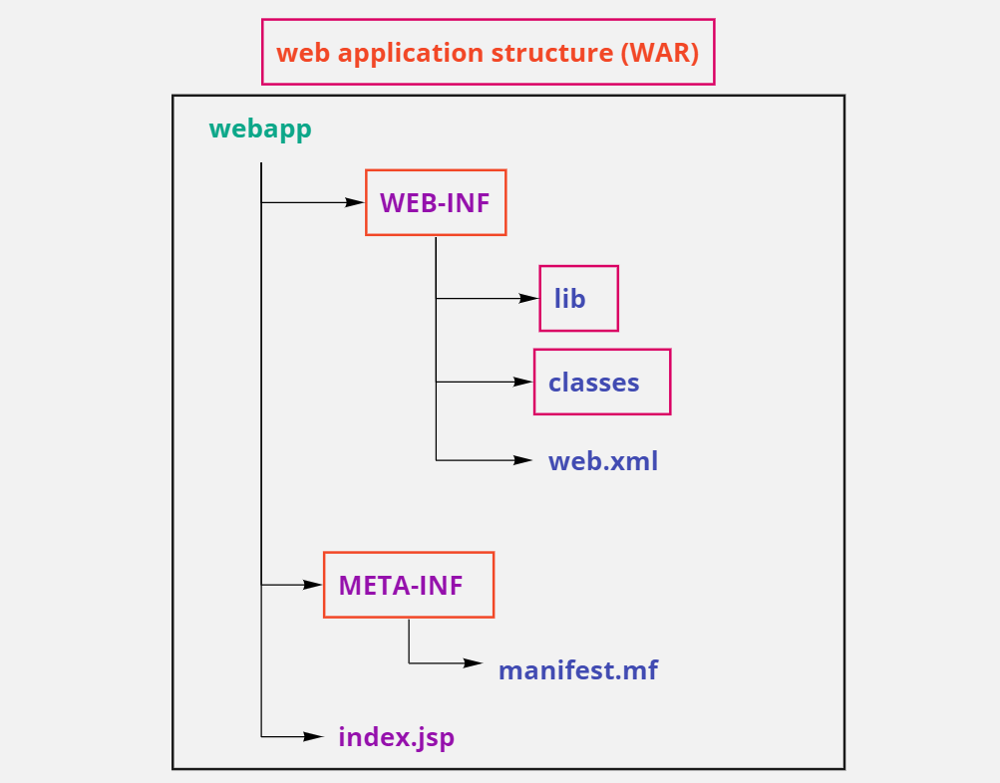

---
## Software Product Build Process

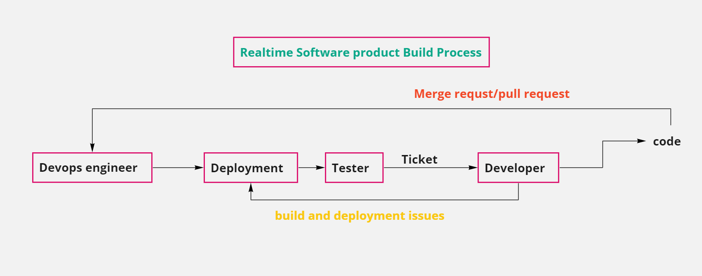

---
