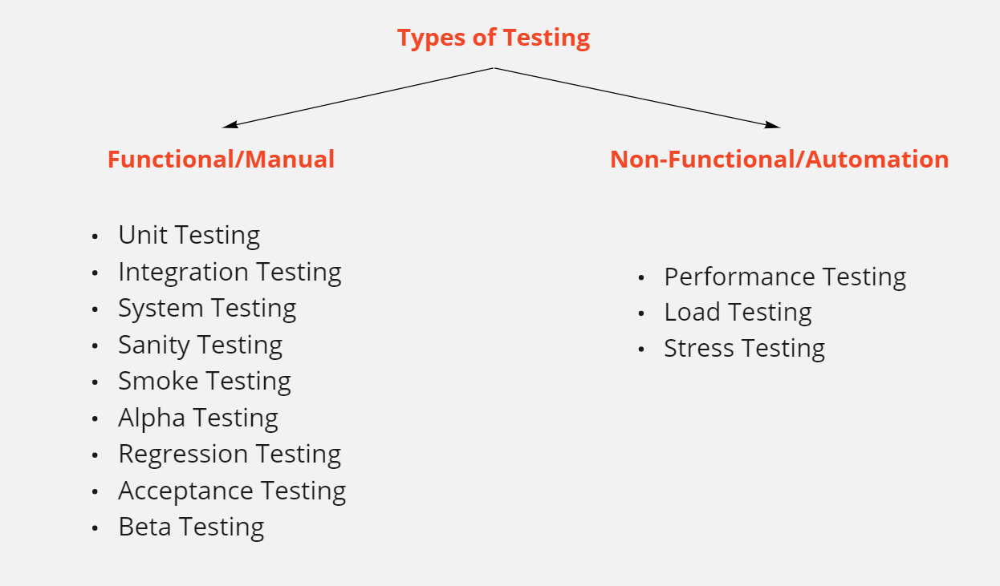

# DEVOPS
Training
# General
---
#### Test Case
------
What is a test case?
In order to get the best out of a product at the end of its production phase, you will need to make sure that it is bug-free. You can do that by hiring a tester and giving him a test case, but what is a test case exactly?

The easiest way to understand it is with the help of its dictionary meaning. “A test case is a set of conditions or variables under which a tester will determine whether a system under test satisfies the requirements or works correctly.”When it is worded like that, it’s simple, isn’t it?

There is no need to worry, creating a test case or a template for it is nothing overcomplicated. For now, all you need to know is that essentially, this is a process where the tester gets in contact with a system and with the help of preset conditions, he tests the system and confirms the end result.

You may have noticed that this sounds a lot like a scientific method and we have to say that it is pretty similar in comparison. A test case, may in the end, be a scientific method not only for detecting bugs but for creating a hypothesis on how to remove them. Here are some examples of steps that a person could test:

- Confirm login functionality when entering valid username and password
- Test results when entering a valid username but invalid password
- Check results when the username field is filled by password field is empty


#### User Story
-----
User Story
Definition: A user story is a small, self-contained unit of development work designed to accomplish a specific goal within a product. A user story is usually written from the user’s perspective and follows the format: “As [a user persona], I want [to perform this action] so that [I can accomplish this goal].”

What is a User Story?
In agile software development, a user story is a brief, plain-language explanation of a feature or functionality written from a user’s point of view. Many agile experts also describe a user story as the smallest unit of product development work that can lead to a complete element of user functionality.

Product teams choose to break development work into user stories instead of product features or product requirements for several reasons.

User stories:
- Are easy for anyone to understand
- Represent bite-sized deliverables that can fit in sprints, whereas not all full features can.
- Help the team focus on real people, rather than abstract features
- Build momentum by giving development teams a feeling of progress


### Testing Types
------


#### In Detail:
---------
#### Unit Testing:
Testing of an individual software component or module is termed as Unit Testing. It is typically done by the programmer and not by testers, as it requires detailed knowledge of the internal program design and code. It may also require developing test driver modules or test harnesses.
Ex: Junit, SOAPUI etc.


#### Integration Testing:
Testing of all integrated modules to verify the combined functionality after integration is termed as Integration Testing.

Modules are typically code modules, individual applications, client and server applications on a network, etc. This type of testing is especially relevant to client/server and distributed systems.


#### System Testing:
Under System Testing technique, the entire system is tested as per the requirements. It is a Black-box type Testing that is based on overall requirement specifications and covers all the combined parts of a system.


#### Sanity Testing:
Sanity testing is a kind of Software Testing performed after receiving a software build, with minor changes in code, or functionality, to ascertain that the bugs have been fixed and no further issues are introduced due to these changes. The goal is to determine that the proposed functionality works roughly as expected.


#### Smoke Testing:
Whenever a new build is provided by the development team then the Software Testing team validates the build and ensures that no major issue exists.

The testing team ensures that the build is stable and a detailed level of testing is carried out further. Smoke Testing checks that no show stopper defect exists in the build which will prevent the testing team to test the application in detail.

If testers find that the major critical functionality is broken down at the initial stage itself then testing team can reject the build and inform accordingly to the development team. Smoke Testing is carried out to a detailed level of any Functional or Regression Testing.


#### Alpha Testing:
It is the most common type of testing used in the Software industry. The objective of this testing is to identify all possible issues or defects before releasing it into the market or to the user.

Alpha Testing is carried out at the end of the software development phase but before the Beta Testing. Still, minor design changes may be made as a result of such testing.

Alpha Testing is conducted at the developer’s site. In-house virtual user environment can be created for this type of testing.


#### Regression Testing:
Testing an application as a whole for the modification in any module or functionality is termed as Regression Testing. It is difficult to cover all the system in Regression Testing, so typically Automation Testing Tools are used for these types of testing.


#### Acceptance Testing:
An Acceptance Test is performed by the client and verifies whether the end to end the flow of the system is as per the business requirements or not and if it is as per the needs of the end-user. Client accepts the software only when all the features and functionalities work as expected.

It is the last phase of the testing, after which the software goes into production. This is also called User Acceptance Testing (UAT).


#### Beta Testing:
Beta Testing is a formal type of Software Testing which is carried out by the customer. It is performed in the Real Environment before releasing the product to the market for the actual end-users.

Beta Testing is carried out to ensure that there are no major failures in the software or product and it satisfies the business requirements from an end-user perspective. Beta Testing is successful when the customer accepts the software.

Usually, this testing is typically done by end-users or others. It is the final testing done before releasing an application for commercial purpose. Usually, the Beta version of the software or product released is limited to a certain number of users in a specific area.

So end-user actually uses the software and shares the feedback to the company. Company then takes necessary action before releasing the software to the worldwide.


#### Performance Testing:
This term is often used interchangeably with ‘stress’ and ‘load’ testing. Performance Testing is done to check whether the system meets the performance requirements. Different performance and load tools are used to do this testing.
Ex: Jmeter, Load Runner, Selenium etc.


#### Load Testing:
It is a type of Non-Functional Testing and the objective of Load Testing is to check how much load or maximum workload a system can handle without any performance degradation.

Load Testing helps to find the maximum capacity of the system under specific load and any issues that cause software performance degradation. Load testing is performed using tools like JMeter, LoadRunner, WebLoad, Silk performer, etc.


#### Stress Testing:
This testing is done when a system is stressed beyond its specifications in order to check how and when it fails. This is performed under heavy load like putting large number beyond storage capacity, complex database queries, continuous input to the system or database load.

#### Testing Methods
- Static - at Development Phase
- Dynamic - at Testing Phase

#### Testing Approaches
- Black Box
- White Box
- Grey Box


### CI/CD Testing:
--------
#### Unity Testing:
UNIT TESTING is a type of software testing where individual units or components of a software are tested. The purpose is to validate that each unit of the software code performs as expected. Unit Testing is done during the development (coding phase) of an application by the developers. Unit Tests isolate a section of code and verify its correctness. A unit may be an individual function, method, procedure, module, or object.

In SDLC, STLC, V Model, Unit testing is first level of testing done before integration testing. Unit testing is a WhiteBox testing technique that is usually performed by the developer.

Jenkins Plugins
- Junit
- SOAP UI

Maven Plugins in POM File
- surefire plugin
- SOAP UI plugin

#### Code Coverage Testing
It is used to check how much unit testing is covered in terms of percentage i.e how much percentage of code is covered for a component or module.

Code coverage is a measurement of how many lines/blocks/arcs of your code are executed while the automated tests are running.

Code coverage is simply a measure of the code that is tested. There are a variety of coverage criteria that can be measured, but typically it is the various paths, conditions, functions, and statements within a program that makeup the total coverage. The code coverage metric is the just a percentage of tests that execute each of these coverage criteria.

- Cobertura
- Jacoco
- custom code coverage plugins


#### Static Code Analysis
Static code analysis is a method of debugging by examining source code before a program is run. It’s done by analyzing a set of code against a set (or multiple sets) of coding rules.

This type of analysis addresses weaknesses in source code that might lead to vulnerabilities. Of course, this may also be achieved through manual code reviews. But using automated tools is much more effective.

Static analysis is commonly used to comply with coding guidelines — such as MISRA. And it’s often used for complying with industry standards — such as ISO 26262.

#Why Use Static Analysis?
- Get code insights before execution
- Executes quickly compared with dynamic analysis
- Code quality maintenance can be automated
- Search for bugs can be automated at early stages (although not all)
- Finding security problems can be automated at an early stage

#Static Code Analysis Tools:
- findbugs
- sonarqube

#### SonarQube
SonarQube is the popular static analysis tool for continuously inspecting the code quality and security of your codebases and guiding development teams during code reviews. SonarQube is used for automated code review with CI/CD Integration. It also offers quality-management tools to help you put it right actively: IDE integration, integration for Jenkins, a popular Continuous Integration server, and code-review tools.

#Key Features
- Multi-Language
- Security Analysis
- Release Quality Code
- Maintainability
- It can identify tricky issues

#Drawbacks
- Not every IDE supports SonarQube
- Don't have the option to ignore the issues that are intentional or the team decides not to fix them

#Language Support
25+ programming languages including Java, C#, JavaScript, TypeScript, C/C++, COBOL and more.

#Pricing:
Community edition is free and open source. License for commercial editions starts at €120.

**Ref:** https://dzone.com/articles/top-7-static-code-analysis-tools

### SDLC Testing:
-------
#### Integration Testing:
#Selenium

Creator: Selenium

Languages: Java, Dockerfile

Selenium is a multi-part integration testing tool. You can use a certain part to quickly create scripts or a more robust part to create larger tests and scripts across multiple environments. This tool is also one of the more popular solutions online.

Some of the core benefits of Selenium include:

It’s an entire suite of tools including Selenium 1, Selenium 2, Selenium Grid and Selenium IDE
Detailed documentation on all of the tools available
Large number of supported browsers for testing

#Cucumber

Creator: Cucumber

Languages: Java, JavaScript, Ruby, Kotlin

Cucumber tops so many lists when it comes to popular and useful integration testing tools, and it’s for good reason. The site explaining the tool is possibly the best-designed, loaded with documentation and laid out well.

A few of the benefits of Cucumber include:

Multiple languages for a wide range of development projects
Large library of video tutorials and other documentation
List of support options available to help with a number of issues

**Ref:** https://www.threatstack.com/blog/50-best-integration-testing-tools

#### System Integration Testing(SIT)
#What is System Integration Testing?
System Integration Testing is defined as a type of software testing carried out in an integrated hardware and software environment to verify the behavior of the complete system. It is testing conducted on a complete, integrated system to evaluate the system's compliance with its specified requirement.

System Integration Testing (SIT) is performed to verify the interactions between the modules of a software system. It deals with the verification of the high and low-level software requirements specified in the Software Requirements Specification/Data and the Software Design Document.

It also verifies a software system's coexistence with others and tests the interface between modules of the software application. In this type of testing, modules are first tested individually and then combined to make a system.

For Example, software and/or hardware components are combined and tested progressively until the entire system has been integrated.

**Ref:** https://www.guru99.com/system-integration-testing.html

#### Software Product Development Strategies

##### Test Driven Development (TDD)
**Ref:** https://www.guru99.com/unit-testing-guide.html#:~:text=UNIT%20TESTING%20is%20a%20type,an%20application%20by%20the%20developers.

##### Delivery Driven Development (DDD)
**Ref:** https://www.codeproject.com/Articles/1257184/Delivery-Driven-Development-DDD

### Sonarqube Install and Configure:
-----
1. install docker
- yum install docker -y
- systemctl start docker
- systemctl enable docker
- systemctl status docker

2. create a container by taking sonarqube image
- docker run --name sonarqube -d -p 9000:9000 sonarqube:latest

3. access or login to sonarqube
- http://IPaddress:port
- username: admin
- password: admin

4. create a project
- create project key
- create project token
- Execute the Scanner for Maven from your computer(do this step after 6th step)

5. install git
- yum install git -y
- git clone https://github.com/HSDKTECH/PetClinic.git

6. install maven
- wget https://mirrors.estointernet.in/apache/maven/maven-3/3.6.3/binaries/apache-maven-3.6.3-bin.tar.gz
- install JDK (javac)
 - yum install java-1.8.0-openjdk-devel -y
 - export PATH=$PATH:/opt/apache-maven-3.6.3/bin/

7. perform sonarqube test(static code analysis)
- cd /root/PetClinic (source code folder)
- Execute the following command
  mvn sonar:sonar \
  -Dsonar.projectKey=portal \
  -Dsonar.host.url=http://54.227.205.20:9000 \
  -Dsonar.login=8bb5f8adcdde7928001b8c2d0af90a996a74642a

8. explore sonarqube
- http://IPaddress:port
  Bugs, Vulnerabilities, codesmells, duplications, code-coverage etc.

#### Commands:
```
    1  hostnamectl set-hostname 'jenkins'
    2  hostname
    3  yum update -y
    4  sudo reboot
    5  docker version
    6  clear
    7  yum install docker -y
    8  clear
    9  docker version
   10  docker images
   11  stystemctl status docker
   12  systemctl status docker
   13  systemctl start docker
   14  systemctl enable docker
   15  clear
   16  systemctl status docker
   17  clear
   18  docker images
   19  docker run --name sonarqube -d -p 9000:9000 sonarqube:latest
   20  docker ps
   21  curl ifconfig.io
   22  history
   23  clear
   24  pwd
   25  clear
   26  git clone https://github.com/HSDKTECH/PetClinic.git
   27  yum install git -y
   28  clear
   29  ls
   30  git clone https://github.com/HSDKTECH/PetClinic.git
   31  ls
   32  clear
   33  cd PetClinic/
   34  ls
   35  clear
   36  ls
   37  cd ..
   38  ls
   39  clear
   40  wget https://mirrors.estointernet.in/apache/maven/maven-3/3.6.3/binaries/apache-maven-3.6.3-bin.tar.gz
   41  ls
   42  tar xzf apache-maven-3.6.3-bin.tar.gz
   43  ls
   44  clear
   45  ls
   46  cd apache-maven-3.6.3/
   47  ls
   48  cd bin
   49  mvn version
   50  mvn --version
   51  ls
   52  mvn --version
   53  mvn version
   54  mvn -version
   55  clear
   56  mvn
   57  ls
   58  javac
   59  java
   60  java --version
   61  celear
   62  clear
   63  ls
   64  mvn
   65  yum install java-1.8.0-openjdk-devel -y
   66  clear
   67  history
   68  clear
   69  mvn
   70  clear
   71  ls
   72  mvn --version
   73  mvn -version
   74  ./mvn
   75  clear
   76  ls -l
   77  clear
   78  cd ..
   79  mvn
   80  ./mvn
   81  clear
   82  pwd
   83  mv /root/apache-maven-3.6.3 /opt/
   84  cd /opt
   85  ls
   86  cd apache-maven-3.6.3/
   87  ls
   88  cd bin
   89  ls
   90  pwd
   91  /opt/apache-maven-3.6.3/binclear
   92  clear
   93  env
   94  clear
   95  lsgf
   96  echo $PATH
   97  $PATH
   98  clear
   99  echo $PATH
  100  pwd
  101  cd ../..
  102  ls
  103  mvn
  104  export PATH=$PATH:/opt/apache-maven-3.6.3/bin/
  105  echo $PATH
  106  mvn
  107  clear
  108  cd
  109  ls
  110  cd PetClinic/
  111  clear
  112  ls
  113  pwd
  114  mvn sonar:sonar   -Dsonar.projectKey=portal   -Dsonar.host.url=http://54.227.205.20:9000 \
  115  cat sonar-project.properties
  116  clear
  117  ls
  118  cd src
  119  ls
  120  grep .java
  121  grep .java .
  122  grep -r .java .
  123  clear
  124  grep -rl .java .
  125  clear
  126  mvn sonar:sonar   -Dsonar.projectKey=portal   -Dsonar.host.url=http://54.227.205.20:9000   -Dsonar.login=8bb5f8adcdde7928001b8c2d0af90a996a74642a
  127  clear
  128  pwd
  129  cd ..
  130  ls
  131  clear
  132  mvn sonar:sonar   -Dsonar.projectKey=portal   -Dsonar.host.url=http://54.227.205.20:9000   -Dsonar.login=8bb5f8adcdde7928001b8c2d0af90a996a74642a
  133  clear
  134  ls
  135  mvn compile
  136  clear
  137  ls
  138  cd target
  139  ls
  140  cd classes/
  141  ls
  142  grep -rl .class .
  143  clear
  144  cd ..
  145  clear
  146  ls
  147  mvn sonar:sonar   -Dsonar.projectKey=portal   -Dsonar.host.url=http://54.227.205.20:9000   -Dsonar.login=8bb5f8adcdde7928001b8c2d0af90a996a74642a
  148  clear
  149  ls
  150  cat sonar-project.properties
  151  history
```
