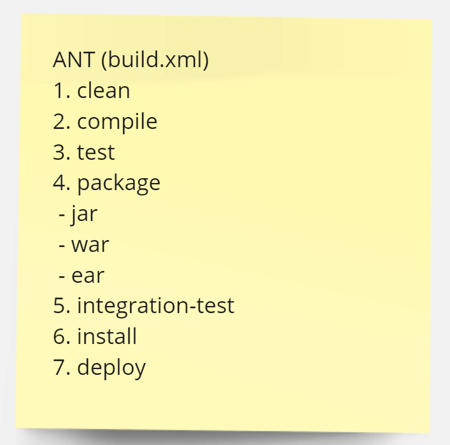
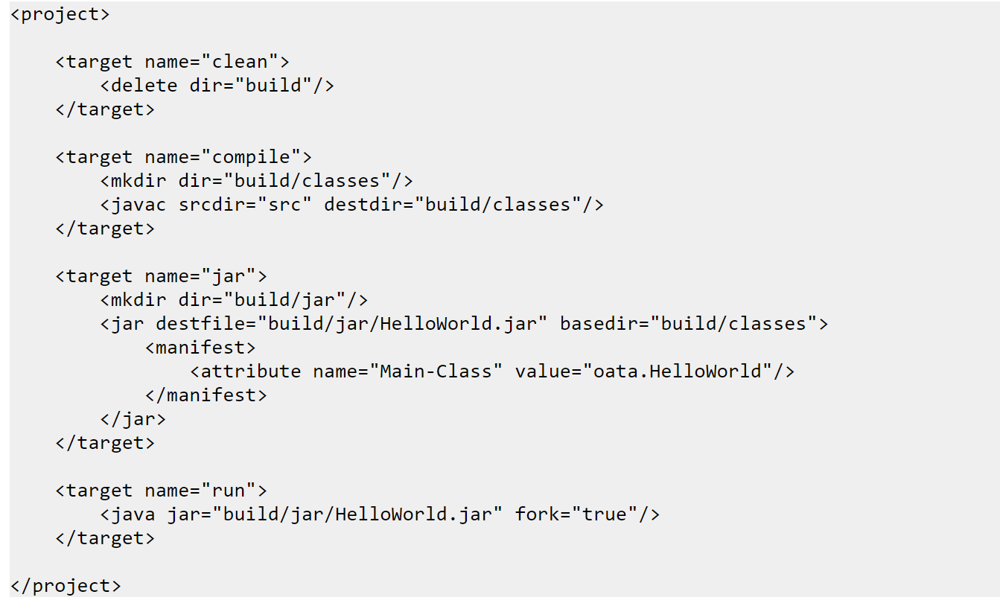
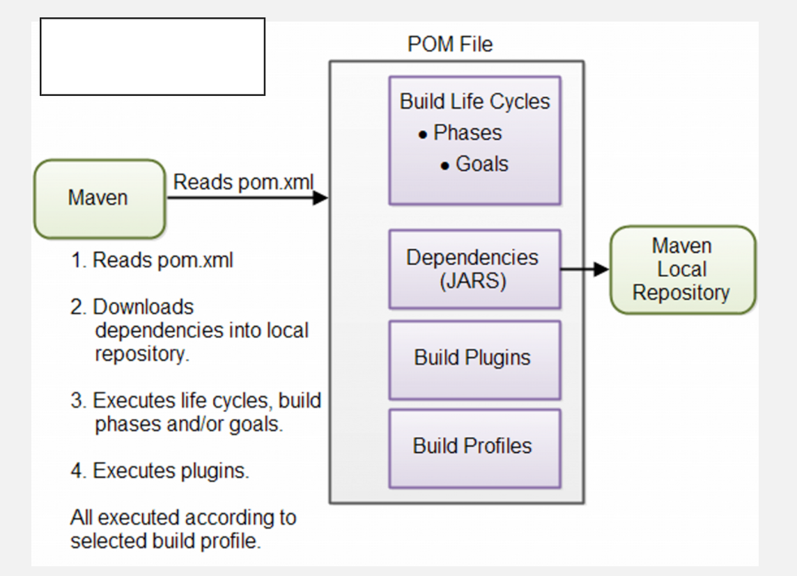
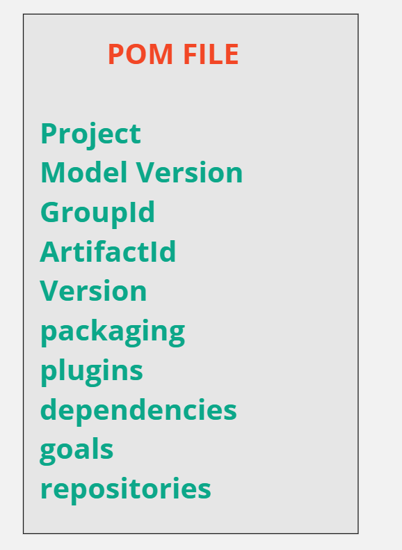

# MAVEN

---
## Maven Build Process


---
## ANT Build File



---
## ANT Build File Template



---

## POM File



---
## POM File Details



---
## Maven installation on amazon linux using internet(source)
```
** Install JAVA **
# install java if it is already not installed on linux
  sudo yum install java-1.8.0-openjdk
  
# check java version
  java -version

** Install Maven **
# Install using yum package manager
  sudo yum install maven

# Download Apache maven from internet
  sudo wget https://downloads.apache.org/maven/maven-3/3.6.3/binaries/apache-maven-3.6.3-bin.tar.gz
  
# Extract tar file
  sudo tar -xzvf /opt/apache-maven-3.6.3-bin.tar.gz
  
# Create a symbolic link to maven
  sudo ln -s /opt/apache-maven-3.6.3 /opt/maven
  
**Setup environment variables**
# Open your text editor and create a new file named maven.sh inside of the /etc/profile.d/ directory.
  
  # sudo vi /etc/profile.d/maven.sh
    export JAVA_HOME=/usr/lib/jvm/jre-openjdk
    export M2_HOME=/opt/maven
    export MAVEN_HOME=/opt/maven
    export PATH=${M2_HOME}/bin:${PATH}
  
# Load new environment variables
  source /etc/profile.d/maven.sh
  
**Verify Maven installation successfull or not**  
  mvn -version
```
---
