# JENKINS
---

## Jenkins Installation - 2 types
```
 1. Install through internet.
 2. Install using Package Manager(YUM)

**Note:** 
  1. pre-request is jdk(java develoment kit) to be installed before Jenkins.
  2. Java compiler(javac) should be worked fine.
```
---
## Jenkins Installation(Using Package Manager - YUM):
```
 1. connect to Linux machine using putty/mobaxterm. 
 2. go to the following location in browser
 https://www.jenkins.io/doc/book/installing/linux/
 3. click on Red Hat/CentOS
 4. execute the commands which are under Long Term Support release on Linux machine one by one
 5. sudo systemctl start jenkins (start Jenkins)
 6. sudo systemctl enable jenkins (adding jenkins service to start up automatically on boot up 
 7. sudo systemctl status jenkins (check the service status it should be in running)
 8. Access the jenkins using web client(firefox, chrome etc)(http://IPaddress:8080)
 9. get the password and paste accordingly.
 10. Install suggested plugins.
 11. provide username as jenkins and other relavent details.
 12. Finally, you will see Jenkins Home Page.

**Note:** 
# Add jenkins user to wheel group with the following command.
  usermod -aG wheel jenkins

# Open the /etc/sudoers file
  sudo vi /etc/sudoers

# find the below line and uncomment it.
  %wheel        ALL=(ALL)       NOPASSWD: ALL
```
---
## Types of Applications


---
## Web Servers


---
## Application Installation Types


---
## Web Applications Deployments to Web Servers


---
## httpd installation

#fff5b1, $bg-yellow-light

```
sudo yum install httpd
sudo systemctl start httpd
sudo systemctl enable httpd
sudo systemctl status httpd

```
---
## nginx installation

```
sudo amazon-linux-extras install nginx1
sudo systemctl start nginx
sudo systemctl enable nginx
sudo systemctl status nginx

Note: Instead of yum repository we need to use amazon-linux-extras package manager to install nginx on amazon linux distribution.
```

---
## Create html web application deployment Job in Jenkins for Apache httpd
```
**SCM:**
url: https://gitlab.com/chinnu1028/beginner-html-site-styled.git
branch: gh-pages

**ExecuteShell**
sudo chmod 777 /var/www/html/
sudo cp -Rf . /var/www/html/
sudo systemctl restart httpd
```
---
## Create html web application deployment job in Jenkins for nginx
```
**SCM:**
url: https://github.com/chinnu1028/project-html-website.git
branch: master

**ExecuteShell**
cp -Rf . /usr/share/nginx/html/
sudo systemctl restart nginx
```
---
## Linux Standard Streams


---
## Jenkins Build and Deployments to Different Environments


---
## Java Web Application Build and Deploy Process


---
## Install Tomcat using internet (source)
```
** Install JAVA **
# install java if it is already not installed on linux
  sudo yum install java-1.8.0-openjdk
  
# check java version
  java -version

** Install Tomcat **
# cd /usr/local
# sudo wget http://www-us.apache.org/dist/tomcat/tomcat-9/v9.0.41/bin/apache-tomcat-9.0.41.tar.gz
# tar -xvf apache-tomcat-9.0.41.tar.gz
# mv apache-tomcat-9.0.41 tomcat9

** Create a User to run Tomcat under systemd **
# useradd -r tomcat

# Give permissions and ownership rights to the Tomcat installation directory.
 chown -R tomcat:tomcat /usr/local/tomcat9
 
** Next, create a tomcat.service unit file under /etc/systemd/system/ directory using VI editor. **
   vi /etc/systemd/system/tomcat.service
  
# Copy and paste the following configuration in the tomcat.service file.
   
   [Unit]
   Description=Apache Tomcat Server
   After=syslog.target network.target

   [Service]
   Type=forking
   User=tomcat
   Group=tomcat

   Environment=CATALINA_PID=/usr/local/tomcat9/temp/tomcat.pid
   Environment=CATALINA_HOME=/usr/local/tomcat9
   Environment=CATALINA_BASE=/usr/local/tomcat9

   ExecStart=/usr/local/tomcat9/bin/catalina.sh start
   ExecStop=/usr/local/tomcat9/bin/catalina.sh stop

   RestartSec=10
   Restart=always
   [Install]
   WantedBy=multi-user.target
  
# Save the file reload the systemd configuration to apply the recent changes using the following command.
  systemctl daemon-reload
  
** Start Tomcat **
# Then start the tomcat service, enable it to auto-start at system boot and check the status using the following commands.
  # systemctl start tomcat.service
  # systemctl enable tomcat.service
  # systemctl status tomcat.service
  
Note: Tomcat uses port 8080 and 8443 for HTTP and HTTPS requests respectively.

** Access the Tomcat Server using web client(web browser) **
   http://IP:8080
   
** Specify the Users for Manager GUI Page and Admin Page Access. **
#  Finally we need to create user accounts to secure and access admin/manager pages. Edit /usr/local/tomcat9/conf/tomcat-users.xml file in your editor and paste inside <tomcat-users> </tomcat-users> tags.

   <!-- user admin can access manager and admin section both -->
   <role rolename="manager-gui,manager-script"/>
   <user username="deployer" password="tomcat123" roles="manager-gui,manager-script"/>
   
** Enable Remote Access to Tomcat Manager and Host Manager**
# By default, access to the Manager and Host Manager apps is restricted to the localhost, the server on which Tomcat is installed and running. But you can enable remote access to a       specific IP address or network e.g your LAN.

# To enable remote access to the Manager app, open and edit the configuration file /usr/local/tomcat9/webapps/host-manager/META-INF/context.xml.
  vi /usr/local/tomcat9/webapps/manager/META-INF/context.xml
  
  Then look for the following line.
   allow="127\.\d+\.\d+\.\d+|::1|0:0:0:0:0:0:0:1 />
  
  allow tomcat access from any host or network.
   allow="127\.\d+\.\d+\.\d+|::1|0:0:0:0:0:0:0:1 |.*" />
   
 ** Restart Tomcat Service **
   systemctl restart tomcat.service
   
 ```
 ---
## Create web application (no compile) deployment Job in Jenkins for tomcat
```
**SCM:**
  url: https://gitlab.com/chinnu1028/javawebapp.git
  branch: master

**ExecuteShell**
  mkdir /usr/local/tomcat/webapps/javaapp
  sudo chmod 777 /us/local/tomcat/webapps/javaapp
  cp -Rf myapp/* /usr/local/tomcat/webapps/javaapp
  sudo systemctl restart tomcat
  
  Note: Access the deployed application using the url http://IP:8080/javaapp
```
---
## Create web application (with compile) deployment Job in Jenkins for tomcat
```
**SCM:**
  url: https://gitlab.com/chinnu1028/maven-project2.git
  branch: master

**Invoke top-level Maven targets**
  Maven Version: maven1
  Goals: clean package

**ExecuteShell**
  cp -Rf webapp/target/portal.war /usr/local/tomcat/webapps/
  sudo systemctl restart tomcat

Note: 1. maven should be installed using internet source and add to Jenkins --> manage jenkins --> Global Tools Configuration as maven1.
      2. Note: Access the deployed application using the url http://IP:8080/portal
```
---
## Ways Of Deployment
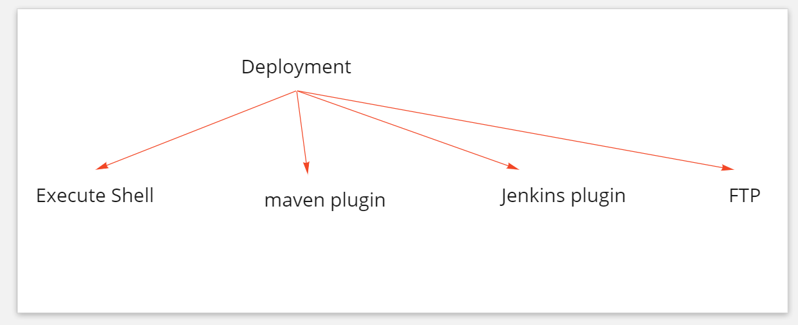

---
## Jenkins Source Code Clone from GIT

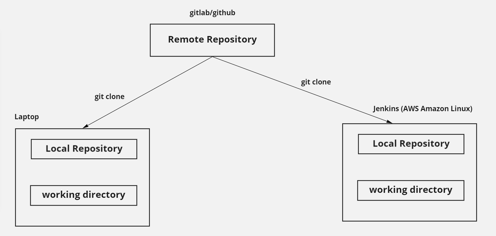

---
## Jenkins Source Code Clone from GIT


---
## Jenkins, GIT and Web server (Web Application Build and Release)


---
## Deployment To Remote Server

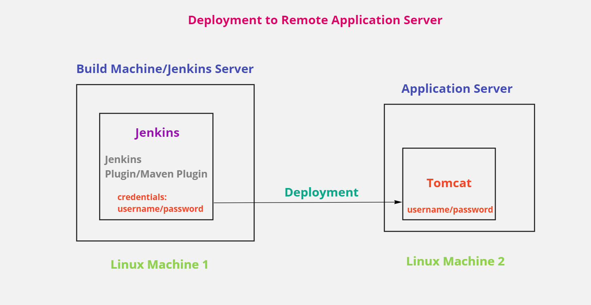

---
## Jenkins Job Types

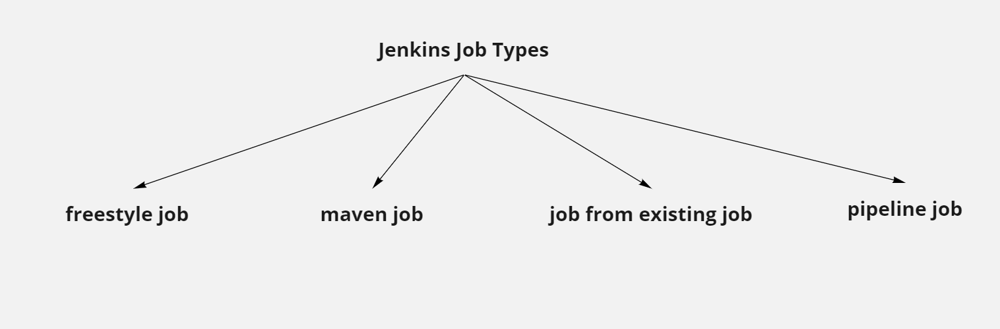

---
## Java web application deployment to Tomcat using Jenkins Plugin
```
# open the file /usr/local/tomcat/conf/tomcat-users.xml and add the below lines at the bottom of the file.
   <role rolename="manager-gui,"/>
   <role rolename="manager-script"/>
   <user username="deployer" password="tomcat123" roles="manager-gui,manager-script"/>

# go to "manage jenkins" and add the credentials using above username and password.
  username: deployer
  password: tomcat123
  
# Download "Deploy to container" plugin in Jenkins

# Add Post Build Action with the below image details(use your tomcat server IP and Port)
```

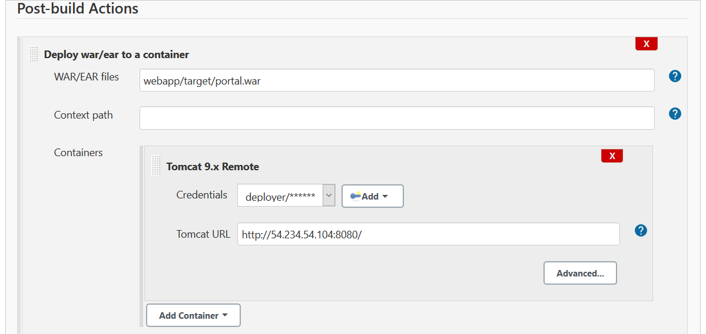

---
## Java web application deployment to Tomcat using Maven Plugin
**usefull URL's:**
```
https://priocept.com/2019/05/21/remote-deployment-of-java-web-applications-with-tomcat/

https://www.journaldev.com/4738/tomcat7-maven-plugin-deploy-war

https://mkyong.com/maven/how-to-deploy-maven-based-war-file-to-tomcat/

```
---
## Swap memory issue fixup
```
https://aws.amazon.com/premiumsupport/knowledge-center/ec2-memory-swap-file/
```
---
## Jenkins GIT Integration

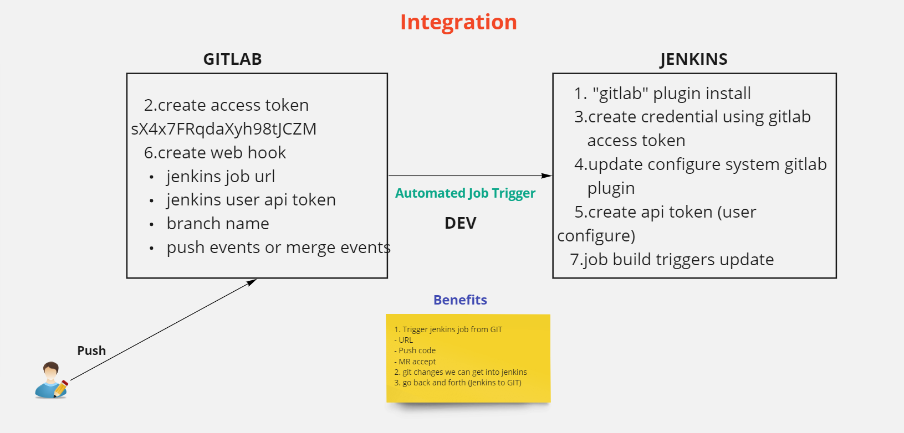

---
## Java WebApplication Project with Maven POM

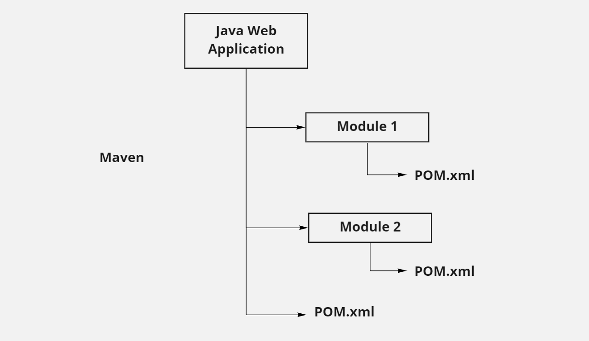

---
## Jenkins Parameters

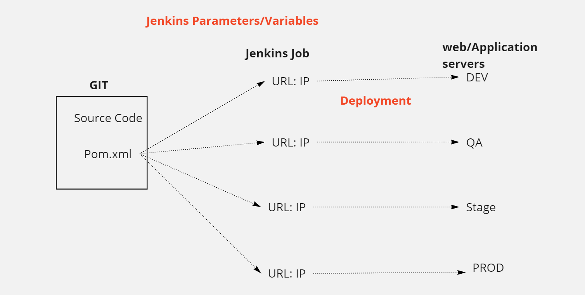

---
## Application Configuration (Properties)
**Properties will be changed for different environments**

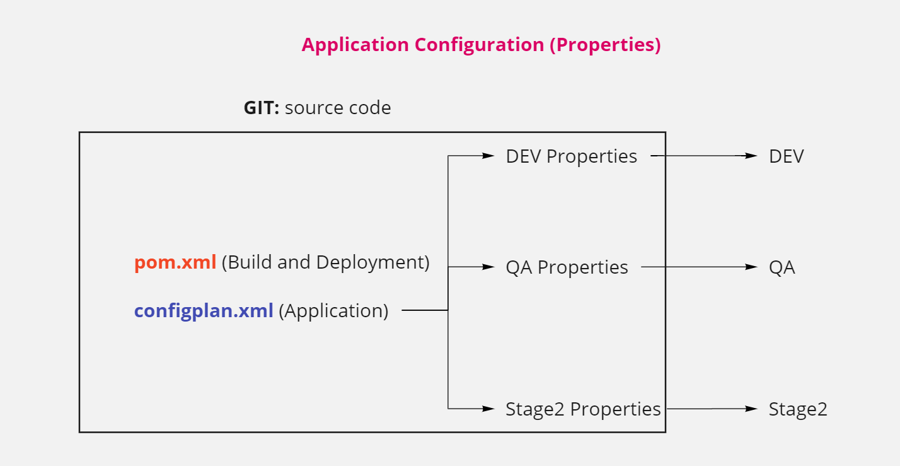

---
## Jenkins Authentication

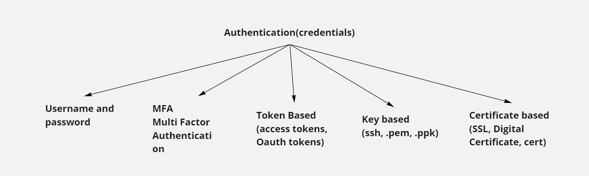

---
## SSL Certificate

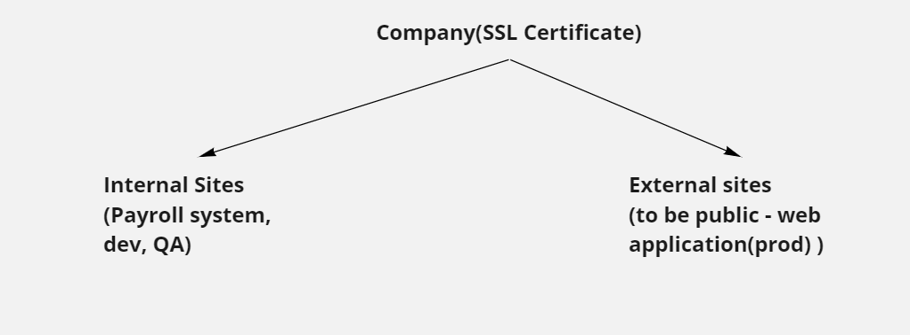

---
## Jenkins Authorisation

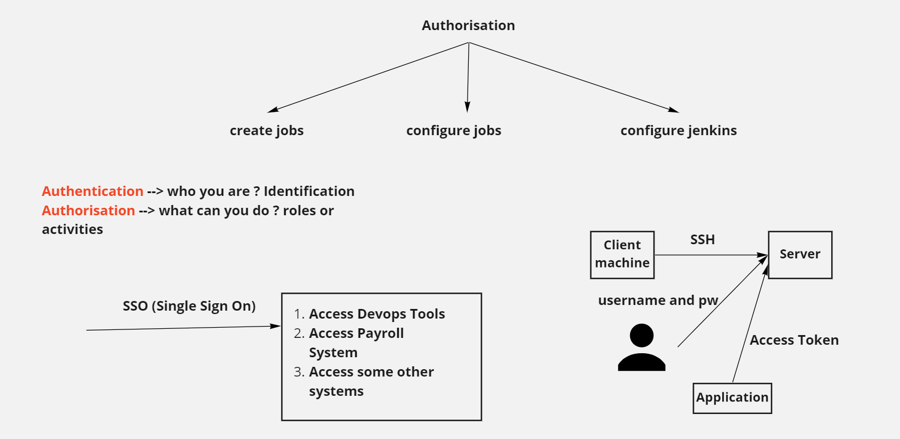

---
## Jenkins Distributed Builds (Master Slave Concept)

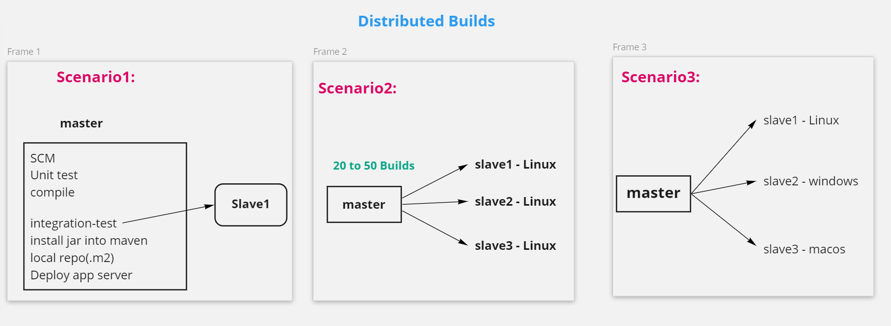

---
## Database_Server_Architecture

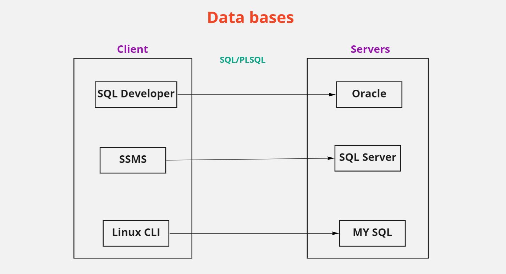

---
## Jenkins Backup and Restore

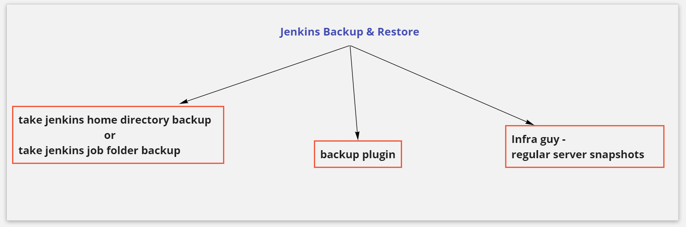

---
## Jenkins Email Configuration

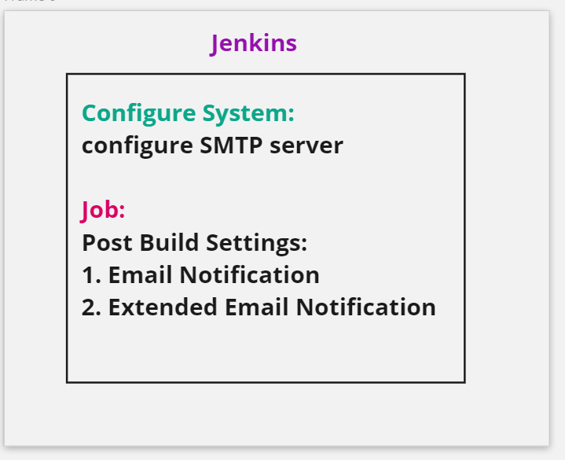

---
## Jenkins Build Triggers

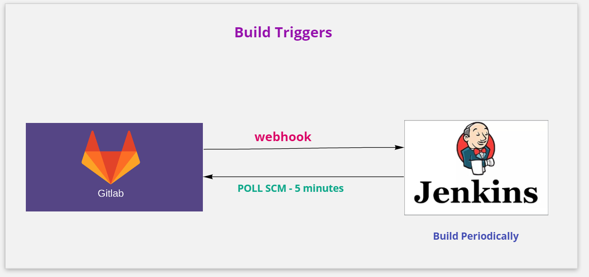

---
## Jenkins Continuous Integration(CI) and Continuous Deployment/Continuous Delivery(CD)


---
## Jenkins CICD

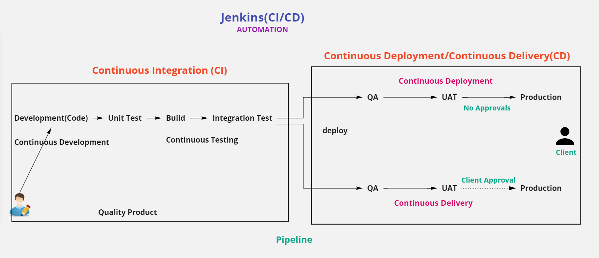

---
## Types of Jenkins Pipelines

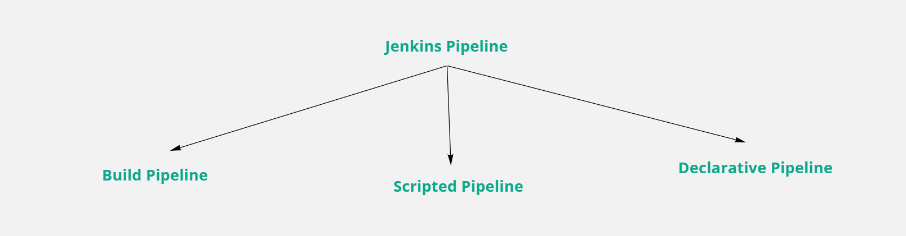

---
## Jenkins Pipeline Benefits

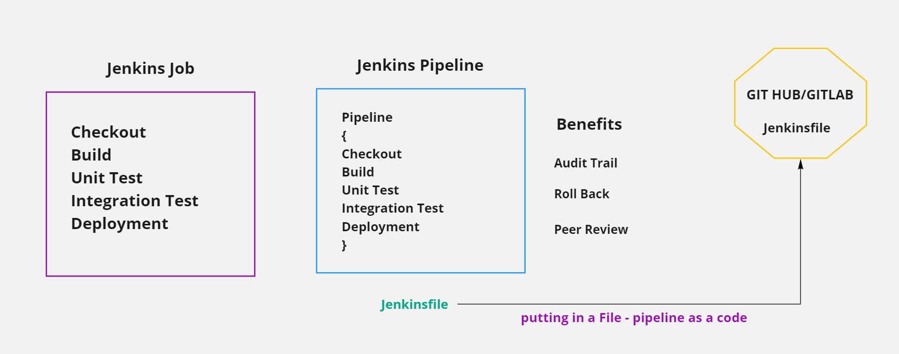

---
## Types Of Pipelines


---
## Declarative Pipeline Insights

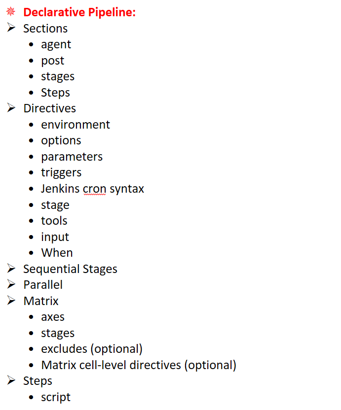

---
## Jenkinsfile

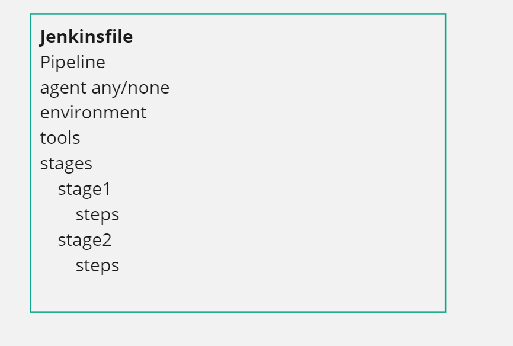

---
