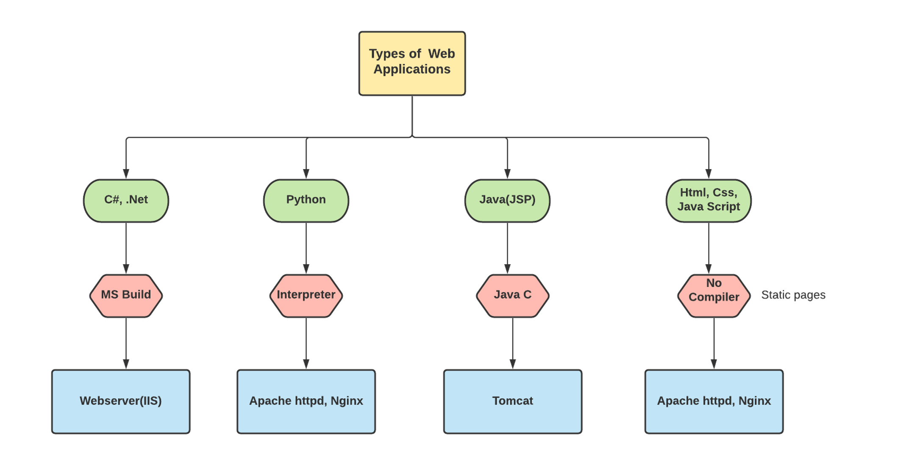
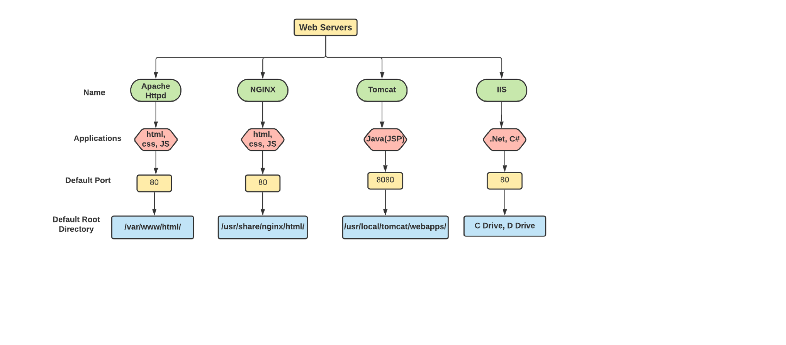
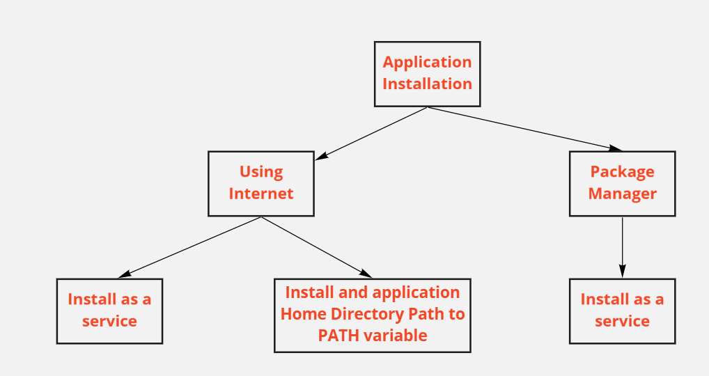
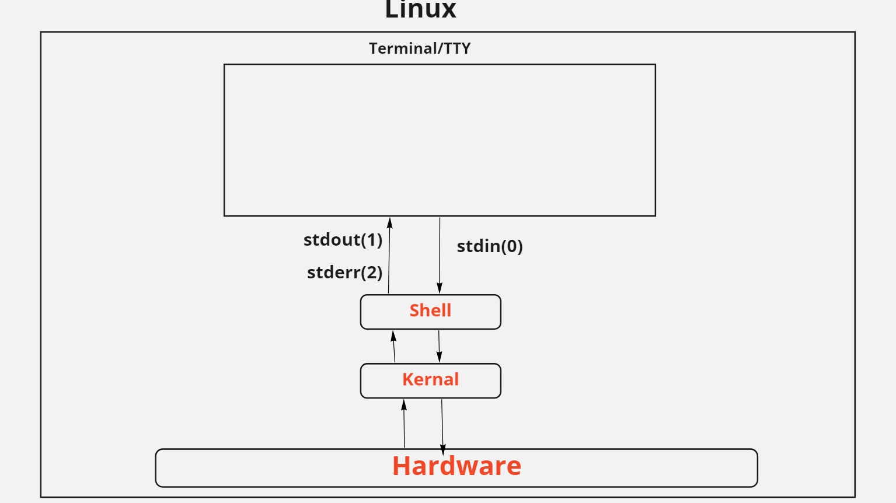
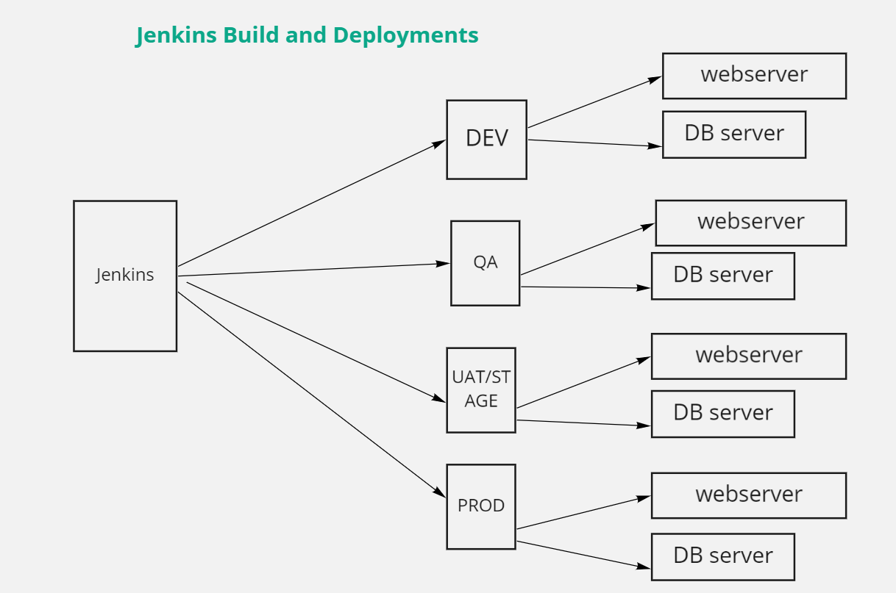
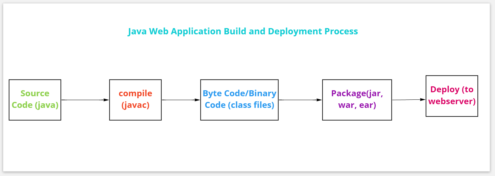

# JENKINS
---

## Jenkins Installation - 2 types
 1. Install through internet.
 2. Install using Package Manager(YUM)

**Note:** 
- pre-request is jdk(java develoment kit) to be installed before Jenkins.
- Java compiler(javac) should be worked fine.

---
## Jenkins Installation(Using Package Manager - YUM):
```
 1. connect to Linux machine using putty/mobaxterm. 
 2. go to the following location 
 https://www.jenkins.io/doc/book/installing/linux/
 3. click on Red Hat/CentOS
 4. execute the commands which are under Long Term Support release on Linux machine one by one
 5. sudo systemctl start jenkins (start Jenkins)
 6. sudo systemctl enable jenkins (adding jenkins service to start up automatically on boot up 
 7. sudo systemctl status jenkins (check the service status it should be in running)
 8. Access the jenkins using web client(firefox, chrome etc)(http://IPaddress:8080)
 9. get the password and paste accordingly.
 10. Install suggested plugins.
 11. provide username as jenkins and other relavent details.
 12. Finally, you will see Jenkins Home Page.

**Note:** Java installation is not required for Package Manager Installations.
```
---
## Types of Applications



---
## Web Servers



---
## Application Installation Types



---
## httpd installation

```
sudo yum install httpd
sudo systemctl start httpd
sudo systemctl enable httpd
sudo systemctl status httpd

```
---
## nginx installation

```
sudo yum install nginx
sudo systemctl start nginx
sudo systemctl enable nginx
sudo systemctl status nginx

```

---
## Create httpd application deployment Job in Jenkins
```
**SCM:**
url: https://gitlab.com/chinnu1028/beginner-html-site-styled.git
branch: gh-pages

**ExecuteShell**
sudo chmod 777 /var/www/html/
sudo cp -Rf . /var/www/html/
sudo systemctl restart httpd
```
---
## Create nginx application deployment job in Jenkins
```
**SCM:**
url: https://github.com/chinnu1028/project-html-website.git
branch: master

**ExecuteShell**
cp -Rf . /usr/share/nginx/html/
sudo systemctl restart nginx
```
---
## Linux Standard Streams



---
## Jenkins Build and Deployments to Different Environments



---
## Web Applications Deployments to Web Servers


---
## Java Web Application Build and Deploy Process


