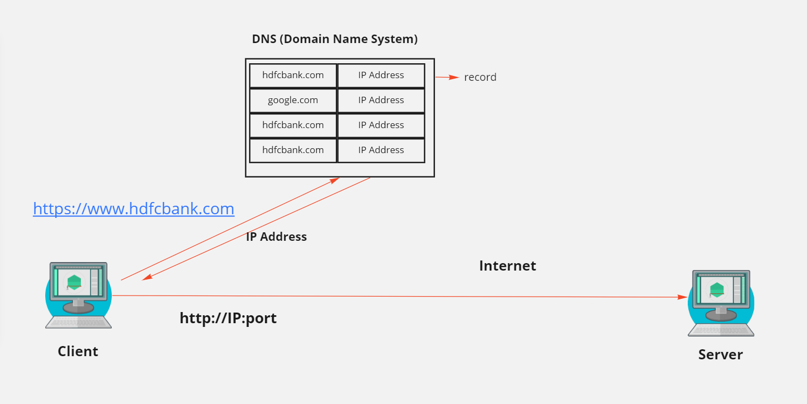
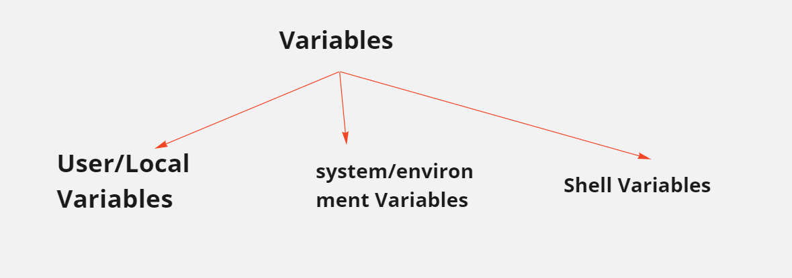

# LINUX
---
## USERS and GROUPS
---
```
**Types of user accounts in Linux**
  
  - Root user - (root user has all permissions)
  - Sudo user -(sudo user will have some of the root permissions but not all)
  - Non sudo user - (will have minimal permissions)

**Commands**
  
  - Sudo -i                           ---> to log in to root user
  - Sudo -su username                 ---> to log in to sudo user
  - Su username                       ---> to switch between the users (non sudo users) (root or sudo user can use this command)
 
**Note:**
  
  1. sudo user is not equal to root user.
  2. normal users cannot login to other user accounts.
```
---
## convert non-sudo user to sudo user
```
# add the non-sudo user to wheel group
  usermod -aG wheel non-sudouser

# add the non-sudo user to 90-cloud-init-users file
 sudo vi /etc/sudoers.d/90-cloud-init-users
```
---
**Examples**
```
# create a user --> useradd username
# change password --> passwd username
# delete user --> userdel username
# create a group --> groupadd groupname
# delete a group --> groupdel groupname
# create a user with existing group --> useradd -g users username 
# add existing user to existing group --> usermod -aG wheel username
```
---
## Important Commands
```
# netstat -anp | grep java/httpd/nginx   --> to check the port number of a application
# ps -ef | grep java    --> to check java process 
# sudo systemctl start servicename    --> to start a service
# sudo systemctl stop servicename    --> to stop a service
# sudo systemctl restart servicename    --> to restart a service
# sudo systemctl status servicename    --> to see the status of a service
# chmod 777 foldername/folderpath    --> to give permission to a folder
# sudo -su sudousername    --> to switch to sudo user
# sudo -i     --> to switch to root user
# top     --> to check the CPU usage
# find /etc -type f -name *filename*    --> to find the file localtion in etc folder
# grep -lr 80 /etc    --> to get the list of filename which have 80 word inside.
# id username    --> command to check a user uid, gid and groups list 

```
---
## DNS (Domain Name System/Server)



---
## Variables
These are nothing but memory spaces and which will be used to store human readable format data or values inside and recall them using $ symbol whenever required.

**Types Of Variables**


---
